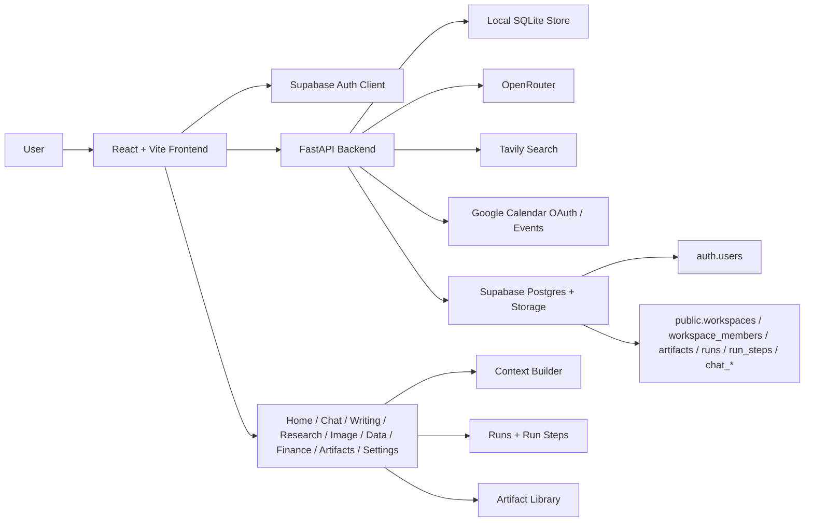

# System Architecture Diagram

## Notes

- The frontend is the primary workspace shell and studio UI.
- Supabase Auth is the intended production session source.
- FastAPI owns orchestration, exports, provider status, runs, compare, and workspace bootstrap logic.
- Local SQLite keeps development unblocked before Supabase setup is fully complete.
- Supabase Postgres and Storage remain the intended production persistence layer.
