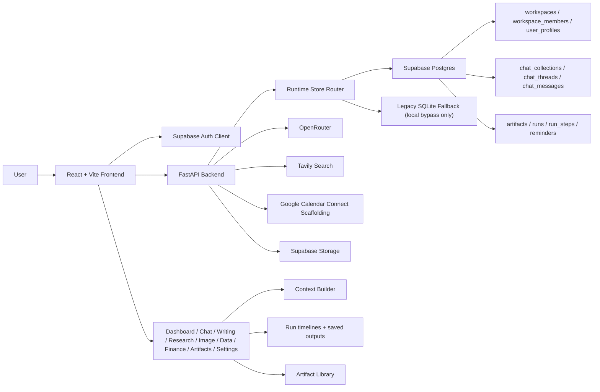

# System Architecture

## Notes

- The frontend is the main workspace shell and studio UI.
- Supabase Auth is the primary hosted session source.
- FastAPI owns orchestration, compare, exports, provider status, run execution, and workspace bootstrap.
- `src/runtime_store.py` now routes authenticated hosted requests to Supabase/Postgres.
- The legacy SQLite store remains only for local bypass and local test-style fallback flows.
- Supabase Storage is used for artifact uploads and generated image files.
- Google Calendar remains scaffolded; the hosted deployment path does not depend on it.
