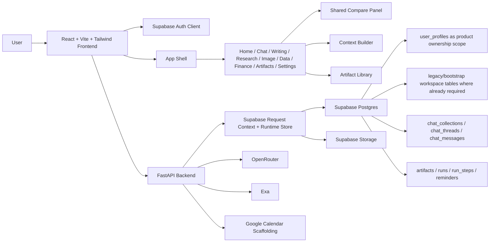

# System Architecture

## Canonical Notes

- Hosted runtime is Supabase-only.
- Authenticated request context is derived from a Supabase session token.
- FastAPI owns orchestration, compare, workspace bootstrap, exports, provider status, and storage URL handling.
- `backend/sql-related-files/` is the live schema source of truth.
- `backend/src/store.py` remains only as a legacy local test store and is not part of the hosted architecture.
- `frontend-mock/` is archived reference material and not an active runtime target.
- `docs/agentic-artifact-workspace-plan.md` defines the next product architecture target for agentic studios and user-profile-scoped artifacts.
- Product-facing artifact and run ownership is user-profile scoped through `owner_profile_id`. Workspace IDs remain in some tables as hidden legacy/internal routing and bootstrap plumbing rather than visible collaboration UX.
- Finance/Dexter is the canonical reference for agent loop, tool calling, run steps, and artifact-producing behavior.
- Research, Data, Writing, Image, Chat, and Compare should converge on the same agentic artifact-producing pattern.
- Live providers are required for product behavior: OpenRouter for LLMs, Exa for research, Supabase for persistence/storage. Do not add deterministic demo fallbacks as product behavior.
- Frontend work should use `high-end-visual-design`, `gpt-taste`, `design-taste-frontend`, and `frontend-design`, while preserving the current Beyond Chat theme and architecture.
- Supabase/Postgres work should use the repo-local `supabase-postgres-best-practices` skill.
