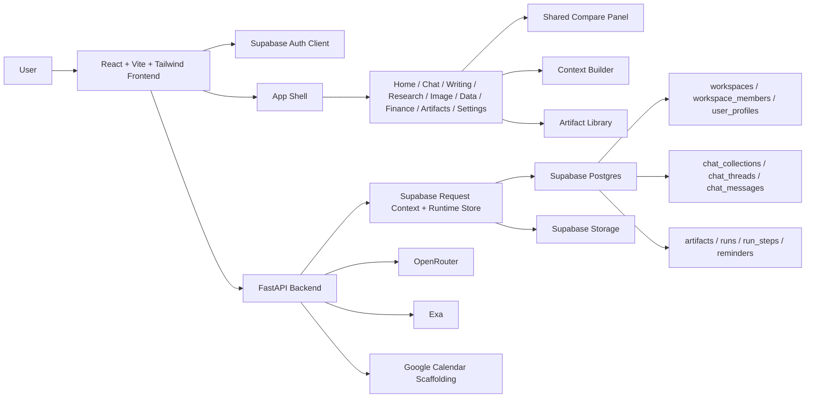

# System Architecture

## Canonical Notes

- Hosted runtime is Supabase-only.
- Authenticated request context is derived from a Supabase session token.
- FastAPI owns orchestration, compare, workspace bootstrap, exports, provider status, and storage URL handling.
- `backend/sql-related-files/` is the live schema source of truth.
- `backend/src/store.py` remains only as a legacy local test store and is not part of the hosted architecture.
- `frontend-mock/` is archived reference material and not an active runtime target.
