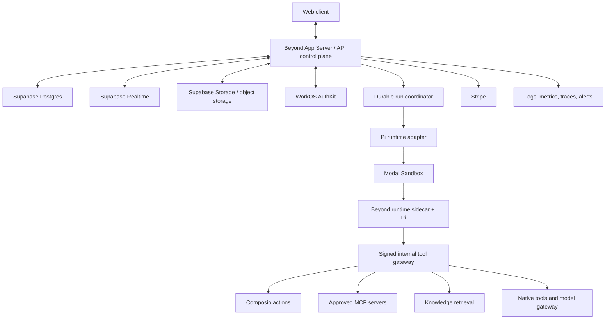

# Beyond Chat: Canonical Product, Architecture, and Execution Plan

**Status:** Canonical master plan  
**Audience:** Product, design, frontend, backend, agent-runtime, data, infrastructure, security, and operations contributors  
**Planning horizon:** Current prototype through initial commercial product, followed by organization-scale hardening and eventual AWS migration  
**Source of truth:** This document is self-contained and is the authoritative product, architecture, and execution plan. It was informed by a private local session transcript, repository inspection, and external research, but no reader or implementer should need that transcript to understand or execute this plan. The transcript is historical provenance only, must remain local and uncommitted because it may contain credentials or personal data, and does not override this document. When older repository documents conflict with this plan, this plan governs unless an explicit later architecture decision record supersedes it.

---

## 1. Executive Decision

Beyond Chat will become a general-purpose, organization-wide AI work environment: a user signs in, opens a project, asks for an outcome, gives the system access to the right company context, and receives a durable, collaborative deliverable rather than a disposable chat response.

The product is not a developer platform, a collection of disconnected “studios,” a thin model chat wrapper, or a coding IDE for nontechnical users. It is a “get in, get work done” workspace for teams such as marketing, finance, strategy, operations, sales, research, and—within carefully bounded capabilities—legal and audit teams. Code remains foundational inside the runtime because agents need it to inspect files, transform data, create documents and presentations, render outputs, and automate workflows. The product, however, exposes tasks, plans, drafts, approvals, outputs, versions, and sources—not terminals, worktrees, PTYs, or infrastructure.

The locked first-generation architecture is:

- **Pi** supplies the general reasoning, streaming, and tool-use loop.
- **Beyond App Server** supplies the product-owned command/event protocol between UI, durable state, and agent runtimes.
- **Modal Sandboxes** supply isolated, code-capable task execution.
- **WorkOS AuthKit** supplies user authentication, organizations, membership, invitations, and the path to SSO/SCIM.
- **Supabase Postgres, Storage, and Realtime** supply durable product state, files, authorization data, events, and lightweight collaboration. Supabase Auth is not the product identity provider.
- **Composio** supplies managed OAuth and broad third-party application actions, but not authorization, memory, knowledge retrieval, or orchestration.
- **Direct connectors, Glean federation, and Databricks MCP/query surfaces** supply permission-aware enterprise knowledge.
- **OpenRouter** supplies the initial provider-neutral model gateway.
- **Vercel** supplies the web application, preview deployments, and the initial control-plane deployment.
- **Stripe** supplies organization subscription and initial seat billing.
- **AWS** is the eventual full-cloud destination when customer, scale, networking, or procurement requirements justify the migration.

Three built-in agent definitions ship first:

1. **General Agent** — default, all-purpose workspace agent.
2. **Research Agent** — web/company research, synthesis, writing, reports, and presentations.
3. **Finance Agent** — Dexter-derived finance and data analysis with evidence-backed output.

Authorized users may create personal, team, and organization agents through a one-click publish workflow. “Deploy” means publish an immutable, validated agent configuration to an audience; it does not mean provision a permanent server.

Product-level autonomous sub-agents are intentionally deferred. The schema and protocol reserve parent/root run fields, but v1 proves one durable agent, bounded tools, approvals, steering, cancellation, knowledge, memory, artifact generation, and one-click publishing first.

---

## 2. Locked Decisions and Superseded Alternatives

| Area | Locked decision | Explicitly rejected or deferred |
|---|---|---|
| Product model | Project-centered Chat + Work workspace | Studios as the primary navigation |
| Agent engine | Maintain a Beyond-owned Pi fork pinned to an exact upstream commit; build selected packages from the vendored fork and expose them only through a Beyond-owned adapter | Consuming public Pi packages as the production source; building the loop from scratch; making Codex or OpenCode the general runtime |
| Code capability | Preserve code, filesystem, shell, rendering, and document-generation capabilities internally | Treating code as a separate Code Studio or exposing a CLI to ordinary users |
| App protocol | Build Beyond App Server inspired by Codex App Server, T3 Code, and Conductor | Coupling the browser directly to Pi, Modal, or provider-native events |
| Sandbox | Modal Sandboxes | Daytona as the initial provider; Vercel Sandbox as the long-term execution plane |
| Identity | WorkOS AuthKit | Supabase Auth UI; raw Google OAuth; Clerk for the primary implementation |
| Database/data plane | Reset the empty Supabase database and replace the legacy 14-table schema with a minimal canonical schema and one clean migration history | Incrementally preserving or adapting the old schema; migrating to Convex now; preserving old schema drift as authoritative |
| App connectivity | Composio for actions and OAuth; direct/federated connectors for knowledge | Treating Composio as the identity, policy, RAG, memory, or orchestration layer |
| Collaboration | Supabase Realtime for presence/events; Yjs provider later for co-editing | Using raw Realtime presence as a CRDT |
| Initial cloud | Vercel + Supabase + Modal | Immediate AWS migration; Railway as a sandbox; GCP as the eventual target |
| Eventual cloud | AWS | GCP as the planned full-cloud destination |
| Environments | Local + ephemeral previews + production; no standing staging product initially | Maintaining a separate staging application before there are users |
| Billing | Initial live price target of **$30 per user per month** | Usage-based or complex packaging in v1 |
| Platform scope | Organization workspace for end users | Public API/SDK developer platform in v1 |
| Product sub-agents | Reserve architecture; do not expose in v1 | Autonomous multi-agent graphs before core reliability |

These decisions may only change through a written architecture decision record that identifies the new evidence, migration impact, and rollback strategy.

---

## 3. North Star, Principles, and Non-Goals

### 3.1 North-star experience

> Open a project, ask for an outcome, attach or discover company context, and let an agent plan and perform the work. The agent can load approved skills, use connected applications, run code in isolation, create collaborative deliverables, request approval before consequential actions, remember the right context at the right scope, and continue after the user closes the browser.

### 3.2 Product principles

1. **Outcome over interface.** Start with what the user needs delivered, not which “studio” they should understand.
2. **Durable work over ephemeral chat.** Plans, tool activity, approvals, outputs, sources, and versions persist and resume.
3. **Artifact-centered delivery.** A report, deck, spreadsheet, dataset, image, or published action is the primary outcome.
4. **Agentic by default.** The same agent runtime powers chat, long work, automations, and built-in/custom agents.
5. **Easy on the surface, explicit underneath.** Friendly `/` discovery and sensible automatic selection hide complexity while traces and policy remain inspectable.
6. **Permission-aware context.** Retrieval and action rights follow the current user, organization, project, and agent version.
7. **Code-capable, not code-centric.** Agents may use code internally; users review domain-relevant outputs and changes.
8. **Human control at consequence boundaries.** Approvals depend on risk and policy, independently of sandbox isolation.
9. **Provider replaceability.** Pi, Modal, OpenRouter, Composio, and hosted collaboration providers sit behind product-owned contracts.
10. **Configuration deployment.** Agent publishing is deterministic, versioned, testable, reversible, and fast.
11. **Provenance by default.** Knowledge retrieval, web claims, tool actions, and output revisions retain citations and causation.
12. **Progressive enterprise depth.** Build organizations, roles, budgets, and basic administrative history now; defer heavy compliance until demand exists.

### 3.3 Initial non-goals

- A general public API, SDK ecosystem, or developer marketplace.
- A dedicated audio/video studio.
- A full coding IDE or Git-oriented workspace.
- DLP, legal hold, eDiscovery, regional residency, BYOK, customer-managed encryption, or FedRAMP-grade controls.
- Fully autonomous sub-agent delegation.
- Permanent per-agent infrastructure.
- Copying all company knowledge into every sandbox.
- Rebuilding every third-party OAuth integration from scratch.
- Migrating to AWS before product-market and customer requirements justify it.
- Claiming a connector is “complete” when it only authenticates or lists records.

### 3.4 Competitive position: why Beyond instead of ChatGPT Work

ChatGPT Work validates the demand for a general-purpose AI workspace and is also the clearest direct competitor. Beyond cannot win by reproducing a generic chat surface, matching a checklist of model features, or claiming broader integration counts. It must win for organizations that need to own, govern, connect, and repeatedly deploy AI work across teams without accepting one vendor's models, runtime, knowledge architecture, or opaque execution model as the entire platform.

The initial wedge is:

1. **Model neutrality with organizational control.** OpenRouter-backed routing, explicit model/provider allowlists, versioned effective configuration, data-handling constraints, budgets, and the ability to change providers without rewriting the product.
2. **Organization-owned reusable agents.** Built-in and custom agents are immutable, evaluated, versioned, permissioned configurations that teams can publish, roll back, and invoke consistently—not merely personal prompts or one-off chats.
3. **Governed execution.** Risk-classed tools, argument previews, approvals, idempotency, sandbox isolation, budget reservation, durable histories, and inspectable causation make consequential agent work administratively controllable.
4. **Permission-aware enterprise knowledge.** Live, synced, and federated access can combine Google Drive, Notion, SharePoint, Confluence, Databricks, Glean, and other sources without flattening their ACLs or copying every source into one uncontrolled index.
5. **Open capability surface.** Composio, MCP, direct connectors, native tools, and versioned skills can coexist behind one policy boundary instead of locking the organization into a single integration marketplace.
6. **Deliverable depth.** Documents, presentations, spreadsheets, datasets, charts, images, and bundles are generated, rendered, validated, versioned, reviewed, and reused as durable work products rather than treated as formatted chat messages.
7. **Transparent, recoverable agent work.** Plans, tool activity, sources, approvals, events, attempts, checkpoints, costs, and outputs remain visible and resumable after browser, worker, or sandbox failure.
8. **Customer control and credible portability.** Product-owned contracts, PostgreSQL, object storage abstractions, containerized execution, and an explicit AWS horizon create a credible path for customers that require stronger data, networking, procurement, or deployment control.
9. **Simple initial commercial model.** A flat per-user starting price is easier to understand than exposing raw token or tool billing, while internal budgets protect unit economics.

These are sequencing inputs, not marketing decoration. Agent governance, enterprise knowledge permissions, deliverable quality, and reusable organization agents receive priority because they are the most defensible differences. Every public competitive claim must be tied to an implemented and verified depth level; Beyond must never claim superiority from architecture that has not shipped.

### 3.5 Competitive proof requirements

Before an organization-scale launch, Beyond must demonstrate with reproducible scenarios that:

- An admin can publish and roll back an evaluated organization agent without engineering assistance.
- The same task can run on multiple allowed models while retaining a stable product protocol, policy, output contract, and cost record.
- Revoking a source permission removes retrieval access without waiting for a full re-index.
- A consequential third-party action is prevented, previewed, approved, executed once, and attributed correctly.
- A browser, worker, or sandbox failure does not destroy the task or its reviewable outputs.
- A generated document or presentation survives rendering and structural validation and can be reviewed as a durable output.
- An organization can inspect who used which agent, knowledge scope, tool, model, and budget without collecting unnecessary raw content.

---

## 4. Current Baseline and Gap Analysis

### 4.1 What exists and should be mined or preserved

The repository is a broad React/Vite + FastAPI prototype with 14 Supabase tables, multi-studio routes, Stripe scaffolding, OpenRouter/Exa/financial-data integrations, and a Dexter finance runtime. Proven behaviors to preserve include:

- Authenticated application shell and workspace bootstrap patterns.
- Chat thread CRUD and streamed responses.
- Writing templates, document library, TipTap editing, and AI editing.
- Research and finance runs with persisted step traces.
- Data upload, preview, profiling, charts, analysis, and output generation.
- Multi-model image generation and gallery patterns.
- Artifact search/export/bundles and cross-capability handoff concepts.
- Compare UI patterns.
- Reminders, provider status, billing UI, and partial calendar behavior.
- Dexter’s finance tools, prompts, DCF/scenario workflows, source extraction, compaction behavior, event structure, and tests.

The current repository remains a source of usable behavior and test cases, not the final architecture. Existing studios should be decomposed into capability packs and unified work surfaces rather than deleted blindly.

The existing local run-to-artifact path is a working product baseline: users can stream chat responses, execute studio workflows, persist runs and steps, and save generated output as documents/artifacts. It remains usable as the internal demo and regression baseline while WorkOS tenancy, the Pi fork, Modal execution, and the durable Beyond event protocol replace its internals incrementally. The program is therefore a strangler migration, not a claim that agent execution and document generation must be proved from zero. No phase may knowingly break the existing local run/document path without an equivalent target path, a migration decision, and a rollback mechanism.

### 4.2 Current infrastructure state at plan creation

- New Beyond-specific Vercel frontend, backend, and sandbox-runner projects are linked and deployed.
- Frontend and backend health endpoints respond; the legacy Vercel sandbox endpoint responds as a POST-only route.
- New Supabase project is reachable through project-scoped MCP with 14 RLS-enabled, empty legacy tables. Those tables and their migrations are transitional, carry no product authority, and will be discarded before real customer data.
- Supabase CLI authentication remains unauthorized and must be repaired before migration automation is trusted.
- WorkOS MCP is authenticated and production AuthKit applications exist, but Beyond redirect URIs, logout URIs, web origins, and branding are not yet configured.
- Modal CLI is authenticated, but no Beyond Modal app, image, secret boundary, or runtime adapter is wired.
- Stripe live reads work, but no live Beyond product or $30/user/month price exists.
- Composio project/key creation was started, but the key is not present in active runtime configuration and no SDK integration exists.
- GitHub and Vercel CLI/MCP access are usable.
- OpenRouter, Exa, and Financial Datasets credentials appear in existing backend/Vercel configuration but require scoped production verification.
- Supabase security advisors report callable `SECURITY DEFINER` warnings for `current_workspace_ids()` and `is_workspace_member(...)`.

### 4.3 Repository and quality debt to resolve before platform expansion

- Dirty working tree with pre-existing document moves/deletions; preserve unrelated changes and establish a deliberate baseline commit.
- Frontend lockfile drift and historically failing clean `npm ci`.
- Frontend lint correctness failures and dependency advisories.
- Large landing/editor chunks and performance debt.
- One stale backend auth-contract test.
- Dexter dependency advisories and an old Pi TUI dependency.
- Competing schema/migration locations and historical drift.
- Current auth contracts are Supabase-centric.
- Current runner uses Vercel Sandbox assumptions and is not the target Modal runtime.
- Current event persistence is finance-specific, not a canonical durable event protocol.
- Current navigation is studio-centric.
- Current organization roles and data ownership are inconsistent.
- Public claims, legal routes, model listings, connector states, and billing-success confirmation require truthfulness review.

### 4.4 Clean-slate interpretation

“Start from scratch” applies to production infrastructure, identity architecture, canonical schema, agent runtime, and deployment topology. It does **not** mean discard all working UI, business logic, Dexter tools, tests, or learned product behavior. Each existing feature receives one of four dispositions:

1. **Adopt unchanged** when it already matches target contracts.
2. **Adapt behind a new interface** when behavior is valuable but architecture is legacy.
3. **Extract as a capability pack/tool** when a studio-specific implementation is reusable.
4. **Retire** when it duplicates the target model, violates security boundaries, or has no proven user value.

---

## 5. Users, Roles, and Core Jobs

### 5.1 Primary user groups

- **Individual knowledge worker:** needs one reliable place to ask, research, analyze, draft, and produce outputs.
- **Team member:** needs shared context, agents, outputs, comments, and reusable workflows.
- **Team builder:** configures team agents, skills, connections, templates, and automations without operating infrastructure.
- **Organization admin:** onboards hundreds of users, controls approved apps and agents, handles memberships and basic usage/budgets.
- **Organization owner:** owns billing, organization policy, high-risk integrations, and final administrative control.
- **Viewer/reviewer:** reads, comments, approves, or exports without broad mutation rights.

### 5.2 Initial role vocabulary

| Role | Core rights |
|---|---|
| Owner | Billing, organization deletion/transfer, all administrative policy, roles, apps, and agents |
| Admin | Members, invitations, groups/teams, approved apps, knowledge connections, budgets, and organization settings |
| Builder | Create/publish team or organization agents, skills, automations, and project templates within policy |
| Member | Use agents, create projects and personal agents, connect allowed personal apps, produce/share work |
| Viewer | View permitted projects and outputs, comment/review where allowed; no default mutation rights |

Resource-level grants refine roles. A global role is never the sole authorization check for a project, connection, agent, memory space, or output.

### 5.3 Representative jobs to be done

- “Create a board-ready competitor report using our strategy docs and current web sources.”
- “Analyze this dataset and build an executive spreadsheet and presentation.”
- “Prepare a weekly finance memo with filings, market data, assumptions, and citations.”
- “Turn campaign notes and brand guidance into a reviewable launch plan.”
- “Use our approved Notion and Drive context, then publish the result back to the right destination.”
- “Create a reusable onboarding agent for the operations team and make it available in one click.”
- “Run this workflow every Monday, stop before sending external email, and ask me to approve.”
- “Resume last week’s task, incorporate reviewer comments, and show what changed.”
- “Onboard 500 employees, map groups to access, and avoid exposing one team’s sources to another.”

---

## 6. Information Architecture and User Experience

### 6.1 Primary navigation

The target shell should emphasize:

- **Home** — recent work, assigned reviews, pending approvals, saved agents, and organization notices.
- **Chat** — fast conversational interaction with the default agent; can be promoted into durable Work.
- **Work** — durable tasks with plans, progress, tools, approvals, checkpoints, and outputs.
- **Projects** — persistent context, members, source scopes, tasks, outputs, memory, and automations.
- **Agents** — built-in agents, personal/team/org directory, builder, versions, and deployments.
- **Automations** — schedules, triggers, run history, failure inbox, and approvals.
- **Knowledge & Apps** — sources, app connections, sync health, access scope, and MCP servers.
- **Admin/Settings** — profile, organization, members, roles, approved apps, usage, billing, and policies.

Artifacts/Documents are not independent top-level product silos. They are generated outputs discoverable inside projects, tasks, search, and recents.

### 6.2 Chat versus Work

**Chat** optimizes for immediate conversation, lightweight questions, and discovery. **Work** optimizes for an outcome that may require planning, long-running execution, tools, approvals, files, collaboration, or resume/recovery.

Promotion from Chat to Work must preserve messages and attached context. Automatic promotion may be suggested when a request requires multiple steps, long execution, risky writes, or structured deliverables; it must not surprise the user by silently changing scope or permissions.

### 6.3 Work task layout

A task contains:

- Goal and current status.
- Conversation/steering thread.
- Plan with step status.
- Attached files and selected knowledge scopes.
- Agent/version/model selection.
- Skill, app, MCP, and native tool activity.
- Approval requests.
- Source/citation drawer.
- Output canvas with version history and review state.
- Usage, timing, and failure/retry summary.
- Share/publish/export controls.

The task surface renders friendly labels from the canonical machine-state model in Section 10.6. `draft` is a pre-run task state rather than an execution state. Operational details such as `leased` and `reconciling` may be collapsed into clear user language, but the underlying state must remain inspectable in the run inspector.

### 6.4 Invocation grammar

The composer uses one discoverable `/` menu with typed namespaces and friendly aliases. This grammar supersedes earlier experiments that assigned separate top-level meanings to `@`, `$`, or `#`. Those characters may remain familiar mention/reference shorthand inside the composer, but `/` is the single entry point for command discovery and every resolved token becomes an explicit typed reference chip.

```text
/@agent-name             invoke a named agent
/skills                  browse and manage skills
/skill <name>            attach or invoke a skill
/apps                    browse connected/available apps
/app <name>              attach an app capability
/mcp                     browse MCP servers/tools
/mcp <server-or-tool>     attach a server/tool
/project <name>           select project context
/file <name>              attach a file or output
/source <name>            attach a knowledge source/scope
/model <name>             choose an allowed model
/image                    request an image output
/document                 request a document output
/spreadsheet              request a spreadsheet output
/presentation             request a deck output
/plan                     request plan-first execution
/work                     promote/start durable work
/schedule                 create an automation from the task
```

Aliases should accept natural variants such as `/notion`, `/drive`, `/finance`, `/research`, `/frontend-design`, `@Finance`, and project/file mentions. `@Finance` is an agent mention alias, not a competing command namespace. The parser resolves every alias into a typed reference such as `agent`, `skill`, `app`, `mcp_tool`, `project`, `file`, `source`, `model`, `output_type`, or `command`, shows exactly what will be attached, and stores the resolved stable ID rather than raw display text. Automatic selection may choose an obvious built-in agent or skill, but the UI must reveal and allow removal of selected scopes before consequential execution.

### 6.5 Universal UI states

Every surface requires complete loading, empty, partial, permission-denied, disconnected, rate-limited, failed, retrying, canceled, and stale-version states. The interface must never present a mock connector, fictional model, unverified billing result, or unavailable capability as operational.

---

## 7. Breadth and Depth Capability Model

### 7.1 Breadth

| Family | Required product breadth |
|---|---|
| Agents | Built-ins, templates, builder, clone, personal/team/org ownership, directory, publish, rollback |
| Skills | Curated packs, private registry, Git/package imports, versions, manifests, trust, compatibility, tests |
| Apps/tools | Composio apps, native product tools, OpenAPI tools, browsers, databases, code execution, risk labels |
| MCP | Server registry, OAuth/credentials, capability discovery, policy, versioning, health, per-agent bindings |
| Memory | User, project, team; episodic summaries, semantic facts, procedures, explicit promotion and deletion |
| Knowledge | Drive, SharePoint/OneDrive, Notion, Confluence, Glean, Databricks, web, files, later Slack/email |
| Outputs | Documents, spreadsheets, presentations, reports, images, datasets, charts, notebooks, export bundles |
| Automations | Schedules, webhooks, app events, file changes, thresholds, manual triggers, approvals, destinations |
| Collaboration | Sharing, members, comments, mentions, presence, version history, branch/compare/restore, review |
| Quality | Traces, replay, eval datasets, graders, golden tasks, A/B tests, regression and promotion gates |
| Organizations | Members, groups/teams, roles, approved apps/agents, budgets, invitations, basic activity history |
| Operations | Usage ledger, cost attribution, quotas, incidents, retries, reconciliation, observability, support tools |

### 7.2 Ten-level depth rubric

Every capability and connector is evaluated through the same maturity ladder:

1. **Connect:** authenticate and establish ownership.
2. **Read:** retrieve with provenance, citations, and permission checks.
3. **Mutate:** perform bounded, validated writes.
4. **Orchestrate:** combine multiple steps and tools.
5. **Control:** approve, cancel, retry, resume, and hand off.
6. **Remember:** retain explicitly scoped context with deletion/retention controls.
7. **Evaluate:** replay, grade, compare, and prevent regressions.
8. **Govern:** enforce permissions, policy, audit, and sensitive-data rules.
9. **Optimize:** manage cost, routing, latency, caching, and reliability.
10. **Scale:** support large organizations, provisioning, isolation, SLAs, and delegated administration.

Roadmaps and marketing must state the achieved level. “Connected” is not synonymous with “production-ready.”

---

## 8. Agent Product

### 8.1 Built-in agents

#### General Agent

- Available everywhere and selected by default.
- Handles conversation, planning, connected apps, files, company knowledge, document/data/image creation, and automation setup.
- Uses capability routing rather than exposing old studio boundaries.
- Can recommend the Research or Finance built-in configuration when specialized prompts/evals/tools materially improve the result.

#### Research Agent

- Combines former Research and Writing product areas.
- Handles permission-aware company knowledge, web research, source evaluation, synthesis, citations, writing, editing, briefs, strategies, reports, and presentations.
- Requires claim/source linkage and explicit uncertainty for weak evidence.

#### Finance Agent

- Preserves and ports Dexter’s tool implementations, prompts, finance skills, source extraction, budgeting, compaction tests, and traces.
- Handles filings, financial datasets, market research, DCF, scenario analysis, tabular analysis, charts, spreadsheets, and evidence-backed memos/decks.
- Becomes the initial parity benchmark for Pi migration.

### 8.2 Custom agents

Ownership scopes:

- **Personal:** visible to the creator unless shared.
- **Team:** managed by permitted team builders and visible to team members.
- **Organization:** published by authorized builders/admins to a directory or selected groups.

Examples include Marketing Campaign, Legal Intake, Customer Briefing, Procurement Review, Sales Research, Weekly Operations, and Brand Writing agents.

### 8.3 Agent definition

An agent definition includes:

- Stable agent identity, name, description, icon, owner, audience, and category.
- Instructions with layered organization/team/project/user overrides.
- Default and fallback models, reasoning level, temperature or equivalent controls, and provider restrictions.
- Enabled skills and exact versions.
- Enabled native tools, Composio toolkits/actions, and MCP servers/tools.
- Knowledge scopes and retrieval policy.
- Memory read/write scopes and memory proposal policy.
- Output types and templates.
- Runtime capability packs and resource limits.
- Network/filesystem permissions.
- Tool-level `allow | ask | deny` rules and wildcard policies.
- Budget, token, wall-time, concurrency, and retry limits.
- Approval policy.
- Eval suite and promotion threshold.
- Visibility, sharing, and deployment destinations.

### 8.4 Builder experience

Provide two synchronized modes:

1. **Conversational builder:** user describes the agent; the system proposes configuration, missing connections, risks, and tests.
2. **Structured builder:** explicit tabs for instructions, model, skills, tools/apps/MCP, knowledge, memory, outputs, runtime, permissions, approvals, budgets, and evals.

Required actions:

- Start from blank or template.
- Clone an existing version.
- Preview exact effective configuration.
- Test with sample inputs and synthetic/real permitted context.
- Inspect tool traces and outputs.
- Compare draft against published version.
- Save draft, publish, deprecate, rollback, and archive.

### 8.5 One-click deployment

Lifecycle:

`Draft → Preview → Validate → Publish → Directory/target availability → On-demand invocation`

Publish preflight must:

1. Validate instruction structure and unresolved placeholders.
2. Pin model/provider configuration.
3. Resolve exact skill, tool, toolkit, and MCP versions.
4. Check required app connections without revealing credentials.
5. Validate knowledge and memory scopes.
6. Evaluate runtime manifest and network/filesystem policy.
7. Validate tool risk and approval coverage.
8. Verify budget and timeout limits.
9. Run smoke prompts and configured evals.
10. Check artifact output/rendering requirements.
11. Freeze an immutable version and manifest digest.
12. Record provenance, publisher, validation results, and release notes.
13. Publish to private, team, selected group, organization directory, organization link, or automation target.

Rollback changes the active deployment pointer; historical runs continue to reference the exact version used.

---

## 9. Target System Architecture



### 9.1 Responsibility boundaries

| Component | Owns | Must not own |
|---|---|---|
| Web client | Interaction, optimistic projections, upload/download, replay, review UI | Authorization truth, secrets, runtime state |
| App Server/control plane | Commands, authorization, projections, runs, events, approvals, connections, billing, policy | Provider-specific agent logic in route handlers |
| Pi adapter | Translating Beyond runtime input/events to Pi | Product tenancy, durable state, provider UI contracts |
| Modal | Isolated ephemeral execution and task working set | Durable conversations, memory, authoritative artifacts, master credentials |
| Tool gateway | Identity-aware policy enforcement and action execution | Long-term agent reasoning loop |
| Supabase | Canonical relational state, object metadata/storage, realtime fanout, authorization data | Product authentication UI |
| WorkOS | Authentication, org/membership lifecycle, invitations, SSO/SCIM path | Fine-grained project/resource authorization truth |
| Composio | Long-tail OAuth, connected accounts, action schemas/execution, triggers | Knowledge ACL index, memory, policies, task orchestration |
| OpenRouter | Model access/routing | Agent definitions, budgets as sole authority, durable runs |

### 9.2 Portability rule

Product code depends on `AgentRuntime`, `SandboxProvider`, `ModelGateway`, `ToolProvider`, `KnowledgeConnector`, `ObjectStore`, and `EventBus` contracts. Provider-specific IDs may be stored as metadata but may not become primary product identifiers.

---

## 10. Beyond App Server and Durable Protocol

### 10.1 Durable hierarchy

```text
Organization
└── Project
    └── Thread
        └── Run
            └── Turn
                └── Item/Event
```

Teams and groups are not mandatory parents in this durable hierarchy. They attach to organizations as ownership, audience, policy, membership, and resource-grant dimensions; a project, agent, skill, connection, knowledge scope, or automation may be owned by or shared with a team. This avoids forcing every project into exactly one team and supports cross-functional projects without duplicating durable work.

`Workspace` is not a synonym for organization, team, or project and does not become another database layer by default. Add a separate workspace entity only if a proven product requirement cannot be expressed through organization, project, team ownership, and resource grants.

The `Run` layer is mandatory because work must survive browser disconnection, function restarts, approvals, retries, worker replacement, and sandbox expiration.

### 10.2 Command model

Representative commands:

- `thread.create`, `thread.rename`, `thread.archive`, `thread.fork`
- `run.start`, `run.cancel`, `run.retry`, `run.resume`, `run.steer`
- `turn.submit`, `turn.interrupt`
- `approval.resolve`
- `context.attach`, `context.detach`
- `output.publish`, `output.restore`, `output.branch`
- `agent.deploy`, `agent.rollback`
- `automation.test`, `automation.pause`, `automation.resume`

Every mutating command includes organization, actor, project/thread/run identifiers as applicable, client-generated idempotency key, expected version where concurrency matters, correlation ID, and schema version.

### 10.3 Event envelope

Every durable event includes:

```text
event_id
event_type
schema_version
organization_id
project_id
thread_id
run_id
turn_id
item_id
sequence
occurred_at
actor_type / actor_id
causation_id
correlation_id
payload or object_reference
visibility/sensitivity metadata
```

Events are persisted before broadcast. Consumers tolerate duplicate delivery and rebuild read models from a sequence cursor.

### 10.4 Core event/item types

- User and agent messages, including streaming deltas and finalized content.
- Plans, step changes, progress summaries, and status transitions.
- Skill, app, MCP, model, and agent selection.
- Knowledge retrieval, source metadata, citations, and access decisions.
- Tool calls, arguments summary, progress, result references, failures, and retries.
- Approval requested/resolved/expired.
- Filesystem/process activity summarized for ordinary users.
- Document, spreadsheet, presentation, dataset, chart, image, and bundle outputs.
- Output validation, render preview, version, diff, review, and publish events.
- Memory recall, proposal, acceptance, update, and deletion.
- Usage, budget reservation, cost finalization, warning, and limit events.
- Checkpoint, lease, heartbeat, cancellation, recovery, and completion.

### 10.5 Transport

- **WebSocket:** bidirectional interactive commands, steering, approvals, and live events.
- **SSE fallback:** read-only event stream when WebSocket is unavailable.
- **REST:** idempotent commands, queries, uploads, snapshots, exports, and large object operations.
- **Object references:** large tool results and binary outputs live in object storage, not event payloads.
- **Reconnect:** client sends last accepted sequence; server replays missed durable events before resuming live delivery.
- **Backpressure:** deltas may be coalesced, but durable semantic events may not be dropped.

### 10.6 State and recovery

Canonical execution state machine:

`accepted → queued → leased → preparing → running ↔ awaiting_approval → completing → completed | failed | canceled`

Recovery transitions may pass through `retrying`, `paused`, `stalled`, or `reconciling` before returning to a normal execution state or entering a terminal state. `draft` belongs to the task/composer before a run is accepted and is not persisted as an execution status. Every state transition is validated server-side and emits a durable event; clients never infer or mutate execution state from UI text.

| Machine state | Default user-facing label | Terminal | Meaning |
|---|---|---:|---|
| `accepted` | Starting | No | Command validated, run identity allocated, and initial event committed |
| `queued` | Waiting to start | No | Eligible for dispatch but not owned by a worker |
| `leased` | Starting | No | A coordinator/worker owns a time-bounded execution lease |
| `preparing` | Preparing workspace | No | Runtime, sandbox, files, policy, and credentials are being prepared |
| `running` | Working | No | Agent or tool execution is making progress |
| `awaiting_approval` | Needs your approval | No | Durable pause at a consequence boundary; compute may be released |
| `completing` | Finalizing output | No | Outputs, validation, usage, citations, and terminal events are being finalized |
| `retrying` | Retrying | No | A retryable attempt failed and a bounded retry is scheduled or starting |
| `paused` | Paused | No | Execution intentionally suspended and resumable |
| `stalled` | Taking longer than expected | No | Expected progress or heartbeat was missed and requires reconciliation |
| `reconciling` | Recovering | No | Durable state is being compared with worker/sandbox/provider state |
| `completed` | Complete | Yes | Required output and terminal accounting committed successfully |
| `failed` | Failed | Yes | No permitted retry remains or a non-retryable error occurred |
| `canceled` | Canceled | Yes | Cancellation was durably accepted and resource teardown was reconciled |

The UI may simplify labels for ordinary users, but operations and support surfaces expose machine state, attempt, lease, reason code, last durable sequence, and recovery action.

Required mechanics:

- Lease ownership and expiration.
- Worker heartbeat.
- Idempotent dispatch and tool calls where possible.
- Attempt records rather than overwriting failures.
- Exponential backoff with capped retries.
- Explicit non-retryable failure classes.
- Checkpoints at semantic boundaries.
- Startup reconciliation for queued/running/expired runs.
- Cancellation propagation from UI to coordinator, Pi, subprocesses, and Modal.
- Approval suspension without holding a process or sandbox indefinitely.
- Safe rebuild of a sandbox from checkpoint and durable working-set manifest.

---

## 11. Pi Runtime Strategy

### 11.1 Fork and upstream approach

- Create a Beyond-owned fork of the maintained Pi repository and preserve upstream history, license notices, security documentation, and authorship.
- The Beyond fork—not the public `@earendil-works/*` packages—is the production source of Pi. Public packages may be inspected or used in isolated comparison spikes, but production builds must resolve to a recorded commit from the Beyond fork.
- Track the selected fork commit in `vendor/pi/UPSTREAM.md` and the application lockfile/build metadata. Record upstream repository URL, upstream commit, Beyond fork commit, import date, license, selected packages, local patches, known advisories, update procedure, and rollback commit.
- Vendor the approved fork revision under `vendor/pi` using a reproducible subtree/vendor-sync procedure. CI verifies that the vendored tree matches the recorded Beyond fork commit and rejects unexplained local edits.
- Build and consume only the required `pi-ai`, `pi-agent-core`, and deliberately selected `pi-coding-agent` modules. Do not ship the TUI or unrelated packages merely because they exist upstream.
- Route all imports through `packages/pi-runtime-adapter`; product packages may not import Pi directly. Beyond commands, events, IDs, permissions, tenancy, policy, memory, knowledge, tools, checkpoints, and outputs remain product-owned contracts.
- Keep the local patch stack as small and separable as possible. Prefer adapter behavior, extension hooks, or an upstreamable change over invasive edits. Do not delete unrelated upstream packages solely for aesthetics because doing so makes merges harder without improving the production artifact.
- Treat Pi as a pre-1.0 dependency with expected API churn. Every proposed update runs license/advisory review, source diff review, dependency diff review, adapter contract tests, built-in-agent evals, tool/cancellation/compaction tests, and rollback verification before promotion.
- Maintain an explicit upstream cadence: monitor continuously for security issues, review ordinary upstream updates on a scheduled cadence, and merge only when the evidence justifies the change. Never auto-update the runtime used by published agent versions.
- Associate each immutable agent/runtime version with the exact Pi fork commit and image digest so an old run can be explained and, within retention limits, reproduced.
- Fork Codex and T3 Code as local/reference repositories, not production dependencies.

### 11.2 Fork acceptance and upgrade gates

The first production fork import is accepted only when:

- The selected packages build reproducibly with repository-approved npm tooling.
- The adapter can start, stream, steer, cancel, compact, invoke tools, checkpoint logical state, and resume without leaking Pi-native event types to the UI or database contract.
- Pi receives only run-scoped credentials and sandbox permissions; no product master secret is reachable from the runtime.
- A recorded upstream commit, vendored commit, dependency lock, image digest, license inventory, and SBOM identify the exact runtime.
- General document generation and a representative Dexter finance scenario pass baseline evals.
- A deliberately interrupted run can resume through Beyond-owned events and working-set recovery.

An upgrade is rejected if it silently changes event semantics, tool authorization, message serialization, compaction quality, cancellation, output quality, model/provider behavior, or cost beyond agreed tolerances.

### 11.3 Preserve from Pi

- Provider-neutral model streaming.
- Tool loop and parallel/sequential tool execution.
- Serializable message state.
- Lifecycle events, hooks, cancellation, steering, and follow-up queues.
- Context compaction.
- Filesystem inspection and editing.
- Shell/process execution and progress.
- Skill loading and extension hooks.
- Artifact discovery patterns.

### 11.4 Remove or abstract assumptions

- User is a developer.
- Project is a Git repository.
- Source code is the primary output.
- Terminal is the primary interface.
- Git diff is the universal review format.
- Markdown/working directory is the product system of record.
- Local user configuration is the tenancy boundary.

### 11.5 Runtime contract

```ts
interface AgentRuntime {
  start(input: RuntimeInput): AsyncIterable<RunEvent>;
  resume(checkpoint: RuntimeCheckpoint): AsyncIterable<RunEvent>;
  steer(runId: string, message: string): Promise<void>;
  cancel(runId: string): Promise<void>;
  checkpoint(runId: string): Promise<RuntimeCheckpoint>;
  inspect(runId: string): Promise<RuntimeStatus>;
}
```

Only `PiRuntimeAdapter` imports Pi-specific identifiers. Contract tests must allow a future specialist Codex adapter or replacement runtime.

### 11.6 Dexter migration

1. Freeze representative finance prompts, expected tool sequences, outputs, citations, costs, and failure cases as eval fixtures.
2. Wrap current Dexter as a legacy runtime adapter.
3. Port tools and finance prompts without changing behavior.
4. Run legacy and Pi paths side-by-side in non-user evaluation.
5. Compare correctness, sources, tool reliability, latency, cost, compaction, cancellation, and trace clarity.
6. Promote Pi Finance only after agreed parity thresholds.
7. Preserve rollback to legacy Dexter until production confidence is established.

---

## 12. Modal Sandbox Execution Plane

### 12.1 Principles

- Sandboxes are disposable compute, never the durable system of record.
- Each run receives the minimum working set and permissions required.
- No full company knowledge mirror is mounted.
- No WorkOS API key, Supabase service key, Composio project key, Stripe secret, or master MCP credential enters the sandbox.
- The sandbox calls a signed internal tool gateway using short-lived run identity.
- A sandbox may disappear at any time without losing authoritative task state.

### 12.2 Provider contract

```ts
interface SandboxProvider {
  create(spec: SandboxSpec): Promise<SandboxHandle>;
  start(id: string): Promise<void>;
  stop(id: string): Promise<void>;
  exec(id: string, command: CommandSpec): AsyncIterable<ProcessEvent>;
  upload(id: string, files: UploadSpec[]): Promise<void>;
  download(id: string, paths: string[]): Promise<ArtifactReference[]>;
  checkpoint(id: string): Promise<CheckpointReference>;
  restore(checkpoint: CheckpointReference): Promise<SandboxHandle>;
  exposePort(id: string, port: number): Promise<Endpoint>;
  terminate(id: string): Promise<void>;
}
```

Implement `ModalSandboxProvider` first and `LocalDockerProvider` for development/contract tests. Keep a future `DaytonaSandboxProvider` possible without shaping v1 around it.

`checkpoint()` and `restore()` are product-level operations, not promises that a provider can serialize a live process. A `CheckpointReference` identifies a recovery bundle containing the last durable run/event cursor, serialized Pi/runtime state where supported, a content-addressed working-set manifest, uploaded output references, filesystem or directory snapshot references, runtime image digest, dependency/skill manifests, and provider metadata. The database event log and object store remain authoritative.

For Modal v1:

- Use stable filesystem or directory snapshots, plus object-storage manifests, for recoverable sandbox files.
- Do not depend on Modal Sandbox memory snapshots for correctness. They are experimental/alpha, may terminate the source sandbox during capture, have limited retention and restore constraints, and may change incompatibly.
- Memory snapshots may later optimize startup for eligible workloads behind a feature flag. Losing or expiring one must degrade to image + filesystem/working-set restoration, never to lost work.
- Never assume an open socket, process, file descriptor, or in-memory secret survives checkpoint/restore. Recreate processes and credentials from durable state.
- Copy final and semantically important intermediate outputs to product object storage before acknowledging their checkpoint event.

### 12.3 Runtime images

**Base image:** Node.js, Python managed with `uv`, Git where needed, Chromium/Playwright, LibreOffice headless, Pandoc, PDF render/extract tools, image utilities, fonts, Beyond sidecar, Pi runtime, MCP client, artifact uploader, and telemetry.

**Documents pack:** DOCX, XLSX, PPTX, HTML/PDF generation and rendering libraries; template/layout validators.

**Data/finance pack:** Polars, Pandas, DuckDB, PyArrow, SQL clients, charting, spreadsheet formula inspection, and Dexter finance tools.

**Research pack:** browser automation, HTML/readability extraction, source archiving, citation extraction, OCR, and robust PDF processing.

**Image/media pack:** image composition/conversion/inspection dependencies required by the Image capability.

Compose images by agent/version manifest rather than installing dependencies per request. Pin OS packages, language packages, browsers, and fonts; generate an SBOM; scan images before promotion.

### 12.4 Skill runtime manifest

Each skill may declare:

```yaml
runtime:
  capability_packs: [documents, browser]
  python: [package==version]
  npm: [package@version]
  binaries: [libreoffice]
  network_allowlist: [api.example.com]
  filesystem:
    readable: [/workspace/input]
    writable: [/workspace/output, /workspace/tmp]
  resources:
    cpu: 2
    memory_mb: 4096
    wall_time_class: standard
```

`wall_time_class` resolves through versioned control-plane policy to provider-specific soft and hard limits. A skill may request a lower explicit timeout, but no manifest may exceed the active execution plane, organization policy, budget, or sandbox lifetime. The policy engine revalidates limits at publication and dispatch so a value valid for Modal cannot accidentally be reused as an invalid Vercel Function configuration.

The control-plane policy engine validates this manifest before execution. Arbitrary dependency installation is denied by default in published organization agents; permitted development/test installs are logged and cannot silently alter the immutable published manifest.

### 12.5 Sandbox lifecycle

1. Validate run and reserve budget.
2. Resolve immutable agent and runtime manifests.
3. Issue short-lived run credentials.
4. Create sandbox from approved image.
5. Upload task working-set manifest and required files/excerpts.
6. Start Beyond sidecar and verify readiness.
7. Start/resume Pi from Beyond logical state and the recovered filesystem/working-set bundle; never assume live process memory survived.
8. Stream normalized events; upload outputs continuously at semantic checkpoints.
9. Suspend/terminate for long approval waits only after committing events, runtime state, output references, and filesystem/working-set recovery data.
10. On completion, validate and upload outputs, finalize usage, and terminate.
11. On failure/expiration, reconcile durable state and restore into a new sandbox if retryable.

### 12.6 Initial operational targets

- Measure cold image start and runtime readiness separately.
- Establish warm-pool only after measured need; avoid paying for idle infrastructure prematurely.
- Enforce organization and global concurrency limits.
- Enforce run wall time below Modal’s maximum lifetime and checkpoint well before forced termination.
- Capture CPU/memory/disk/network usage, process exit codes, and artifact upload status.
- Prove cancellation terminates child processes and resource billing.
- Test restoration with memory snapshots disabled and deleted; correctness must depend only on durable Beyond state and stable filesystem/object recovery primitives.

---

## 13. Skills, Tools, Apps, MCP, and Plugins

### 13.1 Distinct concepts

- **Skill:** versioned instructions, workflows, examples, assets, and optional runtime/tool requirements that teach an agent how to perform a job.
- **Tool:** a callable capability with a schema, risk class, permission policy, and executor.
- **App:** a user- or organization-connected external product such as Notion, Drive, Slack, or Salesforce.
- **MCP server:** a protocol endpoint that exposes tools/resources/prompts and has its own identity, credentials, health, and policy.
- **Plugin/package:** a distributable bundle that may contain skills, tools, MCP definitions, templates, and UI metadata.

The UI can unify discovery through `/`, but the data model and policy engine must not collapse these concepts.

### 13.2 Skills system

Required capabilities:

- Portable `SKILL.md`-style package with manifest, version, owner, license, trust, compatibility, dependencies, and tests.
- Curated built-in registry and private organization registry.
- Git/package import with review and immutable digest.
- Personal/team/org installation scopes.
- Explicit agent bindings and version pinning.
- On-demand discovery without loading every skill into model context.
- Runtime dependency and network declaration.
- Static scanning, prompt-injection review, tool-policy validation, and evals before organization approval.
- Upgrade diff, compatibility check, staged promotion, rollback, and deprecation.

### 13.3 Tool risk classes

| Class | Examples | Default |
|---|---|---|
| Read-only | Search, retrieve, list, inspect | Allow within scoped connection and budget |
| Reversible write | Create draft, add internal comment, save output | Allow or ask by org/project policy |
| External communication | Send email/message, publish page | Ask unless explicitly pre-approved automation |
| Financial/legal/irreversible | Purchase, transfer, delete, sign, submit | Always ask; some actions deny in v1 |
| Administrative | Change members, permissions, credentials | Deny to general agents; dedicated admin workflow only |

Policy resolution intersects organization, role, project, agent version, connection owner, tool, action arguments, and current task.

### 13.4 Composio boundary

Composio owns long-tail OAuth, Connect Links, refresh/reconnection, app action schemas, action execution, provider diagnostics, multiple accounts, and provider triggers.

Beyond owns WorkOS identity, connection ownership, audience, tool risk, approvals, budgets, durable runs, idempotency, audit/activity, memory, knowledge, ACL enforcement, citations, and deletion coordination.

Identity mapping is `WorkOS subject → internal profile UUID → Composio user ID`; never email. Organization-owned connections use a service principal.

Session tool surface is the intersection:

`org-approved apps ∩ actor-accessible connections ∩ agent-version permissions ∩ project policy ∩ task requirements`

Disable Composio remote sandbox. Pin toolkit/tool versions; test upgrades and store exact versions on each run.

### 13.5 MCP platform

Model:

- Server definition and owner.
- Transport and endpoint.
- Auth type/credential reference.
- Organization approval status.
- Capability snapshot and schema version.
- Health/latency/error status.
- Tool/resource risk classification.
- Agent bindings.
- Network and data policy.
- Version/promotion history.

Customer MCP credentials remain in the control plane. Runtime calls pass through the tool gateway. Tool schemas are discovered and cached, then filtered before inclusion in agent context. Server failures are isolated and produce actionable status without corrupting a run.

---

## 14. Enterprise Knowledge Plane

### 14.1 One connector framework

Do not build independent RAG stacks for every source. Use a common lifecycle:

```text
connector_definition
→ organization/user connection
→ credential reference
→ sync job + cursor
→ source resource + revision
→ ACL principals/groups
→ extraction
→ chunks/embeddings and/or federated reference
→ citations
→ tombstones/deletion
```

### 14.2 Retrieval modes

- **Live:** query source/tool at request time for volatile data such as Databricks, calendars, CRM, and selected Glean queries.
- **Synced:** incrementally index documents and permissions for Drive, SharePoint/OneDrive, Notion, and Confluence.
- **Federated:** delegate retrieval to a permission-aware system such as Glean rather than recrawling its underlying sources.

### 14.3 Connector requirements

Every production connector must support:

- User-owned and/or organization/service-account auth with explicit ownership.
- Stable source and revision identifiers.
- Incremental cursor plus full reconciliation.
- Webhooks only as wake-up signals; refetch authoritative state.
- Idempotent fetch and processing.
- Deletion and lost-access tombstones.
- ACL users, groups, inheritance, and identity mapping.
- Rate limits, backoff, retry, and dead-letter handling.
- Health, last success, lag, error, and reconnect status.
- Extraction versioning and reprocessing.
- Citations with source URL/title/revision/timestamp/owner.
- Read/write separation and approval for writes.
- Retention/deletion propagation.

### 14.4 Source sequence

1. Google Drive, including shared drives and change-log replay.
2. SharePoint/OneDrive using Graph delta and notifications.
3. Notion using webhooks plus authoritative refetch.
4. Confluence using OAuth, CQL, restrictions, and incremental polling.
5. Glean federation preserving source permission decisions.
6. Databricks through governed queries, Unity Catalog, Genie/AI Search/functions/MCP—not document crawling.

Later connectors may include Slack, Gmail/Outlook, CRM, ticketing, and warehouses based on validated demand.

### 14.5 Retrieval pipeline

1. Resolve actor, organization, project, agent, and requested scopes.
2. Filter accessible connectors/resources before retrieval.
3. Query live/synced/federated indexes using hybrid keyword, vector, metadata, recency, and authority signals.
4. Re-check ACL at retrieval time.
5. Rerank within token/cost budget.
6. Deliver minimal excerpts/references to the agent or sandbox.
7. Persist retrieval decision, source revision, citation, and permission context.
8. Link output claims to supporting citations.

Prompt-injection detection and content-risk signals inform agent instructions and tool restrictions; they do not replace authorization.

---

## 15. Memory Architecture

### 15.1 Scope types

**User memory:** private preferences, communication style, repeated workflows, saved facts, and personal context. User can inspect, edit, delete, disable, and export it.

**Project memory:** shared project instructions, decisions, vocabulary, accepted assumptions, goals, run summaries, output history, and selected source material.

**Team memory:** team-owned playbooks, conventions, templates, decisions, and successful procedures. It is derived from team-owned content, not copied silently from personal memory.

**Organization knowledge:** permission-aware source content; not personal “memory.”

### 15.2 Memory lifecycle

`candidate → proposed → accepted/auto-accepted by policy → active → superseded/expired/deleted`

Each entry stores scope, owner, type, content, structured facts, source run/output, provenance, confidence, sensitivity, created/updated/last-used time, retention/expiry, and embedding/index version.

### 15.3 Rules

- Shared agents never silently receive personal memory.
- Shared projects use project/team memory and organization knowledge unless a user explicitly attaches personal context.
- Durable memory writes are proposals by default, not automatic extraction of every message.
- Contradictions create a review/update proposal rather than silent overwrite.
- UI shows memory scope chips and allows “why was this recalled?” inspection.
- Deletion removes active retrieval and schedules derived-index cleanup.
- Retrieval is permission-checked and logged.
- Sensitive facts receive stricter retention and may be excluded entirely by organization policy.

---

## 16. Outputs, Artifacts, and Domain Review

### 16.1 Output types

- Rich documents and reports.
- Spreadsheets and financial models.
- Presentations.
- Datasets and transformed tables.
- Charts/visualizations.
- Images.
- Research/source bundles.
- Export bundles containing output, citations, manifest, and version metadata.

### 16.2 Output lifecycle

`working → generated → validating → ready_for_review → approved/published → superseded/archived`

The sandbox working directory is not authoritative. Outputs upload to object storage at checkpoints with database metadata and immutable content hashes.

### 16.3 Domain-native diffs

- Documents: tracked text/structure/style changes.
- Spreadsheets: cell, formula, format, sheet, and named-range changes.
- Presentations: slide thumbnail and element-level comparisons.
- Datasets: schema, row-count, quality, and transformation diffs.
- Images: before/after and generation/edit metadata.
- External actions: old/new field preview.
- Emails/messages: recipients, body, links, and attachments.
- Agents: instruction, model, skill, tool, knowledge, memory, permission, and budget diffs.

### 16.4 Validation

- File opens and conforms to expected format.
- Render preview succeeds.
- No clipped/overflowing layout beyond defined tolerance.
- Fonts and assets resolve.
- Links and citations resolve where possible.
- Spreadsheet formulas and references are inspected.
- Claims requiring sources have citations.
- Output contains no accidental secrets or internal tool payloads.
- Accessibility checks apply where supported.

---

## 17. Collaboration

### 17.1 Supabase Realtime responsibilities

- Presence and current project/task/document state.
- Typing indicators and coarse cursor presence.
- Comments, replies, mentions, notifications, and activity.
- Run and agent progress.
- Record-change fanout.

Do not use high-frequency Presence/Broadcast as the collaborative document consistency model.

### 17.2 Collaborative editing

Use TipTap + Yjs with an initially hosted Yjs provider such as Liveblocks for true concurrent document editing. Supabase retains ACLs, snapshots, metadata, output versions, comments/activity, and durable state. Provider abstraction should permit later self-hosting.

### 17.3 Collaboration model

- Project outputs may be live and co-editable.
- Agent runs are immutable histories that can be steered, canceled, forked, replayed, or used to create new output versions.
- Two users do not mutate the same internal run history concurrently.
- Users fork tasks or output branches, compare results, and promote a chosen version.
- Comments anchor to text selections, cells, chart elements, slides/images, or source claims.
- Sharing honors project/resource permissions and may be internal-only initially.

---

## 18. Automations

An automation is a saved composition of:

`trigger + agent version + instructions + project + skills + apps/tools + knowledge scope + memory policy + approval policy + budget + destination`

### 18.1 Triggers

- Schedule.
- Incoming signed webhook.
- Composio/app event.
- New email or message.
- Calendar event.
- CRM update.
- File/source change.
- Dataset refresh.
- Manual button.
- Threshold/monitoring condition.

### 18.2 Destinations

- Project/task inbox.
- Shared output.
- Assigned review task.
- Email/Slack/Teams after approval policy.
- Connected app write action.

### 18.3 Required controls

- Test run with visible inputs.
- Enable/disable and pause/resume.
- Owner, audience, and service-principal identity.
- Last/next execution.
- Run history and failure inbox.
- Idempotency/deduplication key.
- Concurrency and overlap policy.
- Cost and action limits.
- Approval handling and expiry.
- Retry/backoff and dead-letter behavior.
- Version pinning; updates require explicit promotion.

Composio triggers enter through signed webhook verification, deduplication, normalization, and durable scheduling. They do not execute an agent directly.

---

## 19. Identity, Organizations, and Authorization

### 19.1 Identity architecture

WorkOS owns login, sessions, organizations, memberships, invitations, groups/provisioning, and enterprise authentication. Internal UUIDs remain product primary keys.

Core mapping:

```text
WorkOS user subject → external_identity → profile UUID
WorkOS organization → organization UUID
WorkOS membership/roles/groups → synchronized internal membership and grants
```

Never use email as a stable identity key. Database membership/resource grants remain authoritative for product access.

### 19.2 WorkOS implementation

- Select the correct newly created production environment/application.
- Configure Beyond production origin, callback, logout, homepage, invite, and password-reset URLs.
- Add branding.
- Configure secure cookies, session duration, inactivity, CSRF/state/nonce, and token verification.
- Register webhook endpoint; verify signature; handle replay/idempotency.
- Synchronize user, organization, membership, role, and group lifecycle events.
- Add invitation and organization-switch flows.
- Configure Supabase third-party WorkOS JWT verification where direct client access is retained.
- Remove Supabase Auth UI/raw Google OAuth only after WorkOS parity and migration tests.

### 19.3 Authorization evaluation

Authorization is deny-by-default and resolves:

`actor identity + organization membership + global role + team/group membership + resource grant + project membership + agent policy + connection ownership + requested action`

All backend routes, database policies, Storage objects, Realtime channels, tool gateway actions, knowledge retrieval, and collaboration providers must enforce equivalent scope. Frontend hiding is not authorization.

### 19.4 Initial organization features

- Organization creation/onboarding and switcher.
- Invitations and bulk onboarding.
- Members, teams, groups, and roles.
- Shared projects, agents, skills, apps, knowledge, and automations.
- Organization-approved applications and MCP servers.
- User- and organization-owned connections.
- Basic budgets, usage, and administrative activity history.
- SSO/SCIM-ready mapping; sell/enable advanced provisioning when needed.

---

## 20. Canonical Data Model

The existing 14-table Supabase schema and its migration chain are transitional legacy scaffolding. The database is empty, so the preferred migration is a deliberate destructive reset before real users or customer data—not a long sequence of compatibility migrations that preserves concepts the new product does not want. After an export/backup for forensic safety, remove the legacy chain, define a clean baseline migration, replay it into an empty local database, apply it to the linked Beyond project, and verify local/remote schema equivalence. No production customer data may be accepted until this reset is complete.

The exact SQL evolves through migrations, but the conceptual entities below describe the planning horizon, not permission to create every table immediately. Every organization-owned table includes `organization_id`; mutable entities use timestamps and appropriate version/concurrency fields; external provider IDs are secondary unique columns. Tables are introduced only in the phase that owns their behavior, authorization tests, lifecycle, and deletion semantics.

### 20.0 Minimal first schema

The clean database begins with the smallest relational foundation capable of supporting WorkOS tenancy, projects, durable runs, outputs, and authorization. The initial baseline should usually contain only:

- `profiles` — internal user identity keyed independently from WorkOS.
- `external_identities` — WorkOS subject and future identity mappings.
- `organizations` and `organization_memberships` — tenant and fixed initial roles.
- `teams` and `team_memberships` only when the first team-owned resource is implemented; groups may initially map from WorkOS metadata or be deferred.
- `projects` and `project_memberships` — durable work boundary and explicit access exceptions.
- `threads`, `runs`, `run_attempts`, `turns`, and `run_events` — minimum durable execution spine.
- `outputs`, `output_versions`, and `output_files` — durable deliverables and binary/object references.
- `approvals` — consequence-boundary decisions where required by the first runtime.
- `usage_events` and `cost_ledger` — immutable metering from the first canonical run.
- `credential_references` only when the first external connection is wired; values remain outside Postgres.

Where a separate table does not yet buy correctness, authorization clarity, queryability, lifecycle control, or referential integrity, prefer a versioned JSON field on an owning record and promote it later through a tested migration. Conversely, do not hide core ownership, membership, event ordering, billing, or permission relationships inside JSON merely to reduce the table count.

### 20.1 Identity and tenancy

- `profiles`
- `external_identities`
- `organizations`
- `organization_memberships`
- `groups`, `group_memberships`
- `teams`, `team_memberships`
- `workspaces` only if a separate workspace layer remains justified
- `projects`, `project_memberships`
- `roles`, `permissions`, `role_bindings` or a deliberately simpler fixed-role equivalent

### 20.2 Agent catalog

- `agents` — stable identity/ownership.
- `agent_drafts` — mutable builder state.
- `agent_versions` — immutable configuration and manifest digest.
- `agent_deployments` — active version per audience/destination.
- `agent_bindings` — skills/tools/apps/MCP/knowledge/memory.
- `agent_eval_bindings` and `agent_validation_results`.

### 20.3 Skills, tools, apps, and MCP

- `skills`, `skill_versions`, `skill_installations`, `skill_dependencies`.
- `tool_definitions`, `tool_versions`, `tool_risk_policies`.
- `app_definitions`, `connection_owners`, `integration_connections`, `connection_health`.
- `mcp_servers`, `mcp_server_versions`, `mcp_capabilities`, `mcp_bindings`.
- `credential_references` storing vault/provider references, never plaintext secrets.

### 20.4 Threads, runs, and durability

- `threads`, `thread_participants`.
- `runs`, `run_attempts`, `run_leases`, `run_checkpoints`.
- `turns`, `run_events`, `run_event_payloads` for large/reference payloads.
- `tool_calls`, `tool_results`, `approvals`.
- `budget_reservations`, `usage_events`, `cost_ledger`.
- Reserved `parent_run_id`, `root_run_id`, and `delegation_depth` for future sub-agents.

### 20.5 Outputs and collaboration

- `outputs`, `output_versions`, `output_files`, `output_renders`, `output_validations`.
- `comments`, `comment_anchors`, `mentions`, `notifications`.
- `shares`, `review_requests`, `review_decisions`.
- `activity_events`.

### 20.6 Knowledge and memory

- `connector_definitions`, `knowledge_connections`, `sync_jobs`, `sync_cursors`.
- `source_resources`, `source_revisions`, `source_acl_principals`, `source_tombstones`.
- `content_extractions`, `content_chunks`, `embedding_revisions`, `retrieval_events`, `citations`.
- `memory_spaces`, `memory_entries`, `memory_revisions`, `memory_proposals`, `memory_retrievals`.

### 20.7 Automations and billing

- `automation_definitions`, `automation_versions`, `automation_triggers`, `automation_executions`, `automation_failures`.
- `billing_customers`, `subscriptions`, `subscription_items`, `entitlements`, `seat_snapshots`, `billing_events`.

### 20.8 Database rules

- The currently applied legacy migrations are explicitly non-authoritative and will be discarded while the database is empty.
- After the reset, one root `supabase/migrations` history is authoritative. No second SQL directory, dashboard-only mutation, or copied timestamp chain may compete with it.
- The clean baseline migration represents the new product directly; it must not recreate legacy studio tables solely for compatibility.
- All exposed tables use RLS; privileged helper functions are private or have tightly revoked execution.
- RLS policies use direct membership predicates designed to avoid recursion and privilege escalation.
- Storage bucket/object policies receive separate adversarial tests.
- Migrations must replay from empty database and match remote schema.
- Each migration declares forward behavior, rollback/recovery strategy, data impact, lock risk, and whether it is reversible. Destructive production migrations require a verified backup and explicit approval even before external users exist.
- Dashboard changes are permitted only for investigation or emergency response and must be immediately captured as migrations or reverted; remote drift blocks deployment.
- Generate typed clients after migration changes.
- Index foreign keys, membership predicates, event sequence lookups, queue/reconciliation queries, sync cursors, and retrieval filters.
- Use append-only semantics for run events, usage ledger, immutable agent versions, and audit-relevant records.

### 20.9 Table-admission and lifecycle rules

A proposed table is admitted only when its owning phase specifies:

1. Stable identity and tenant/owner relationship.
2. Authoritative writer and allowed readers.
3. RLS and service-role behavior.
4. Creation, update/versioning, archival, deletion, and retention semantics.
5. Required uniqueness, foreign keys, indexes, and concurrency behavior.
6. API/event contract and expected query pattern.
7. Migration replay and cross-tenant tests.
8. Whether the data is authoritative, derived/rebuildable, or an external-provider cache.

This rule intentionally delays speculative tables for advanced memory, connector sync, automations, collaboration, and billing until their behavior is implemented. “Minimal” means fewer ambiguous concepts and less premature persistence—not denormalized permissions, missing constraints, or a single unbounded metadata table.

---

## 21. API and Service Boundaries

### 21.1 API modules

- `/auth` and `/session`
- `/organizations`, `/members`, `/groups`, `/teams`
- `/projects`
- `/threads`, `/runs`, `/events`, `/approvals`
- `/agents`, `/agent-versions`, `/deployments`
- `/skills`, `/tools`, `/apps`, `/connections`, `/mcp`
- `/knowledge`, `/sources`, `/syncs`, `/retrieval`
- `/memory`
- `/outputs`, `/versions`, `/comments`, `/reviews`
- `/automations`
- `/usage`, `/billing`, `/webhooks`
- `/internal/dispatch`, `/internal/tool-gateway`, `/internal/reconcile`
- `/health/live`, `/health/ready`, `/health/dependencies`

### 21.2 API requirements

- Explicit request/response schemas and stable error codes.
- Organization context derived from verified identity and explicit selection, never trusted header alone.
- Idempotency for run creation, external writes, webhook consumption, publish/deploy, and billing operations.
- Cursor pagination for events and large lists.
- Optimistic concurrency for drafts and mutable shared state.
- Signed upload/download URLs with scoped expiry.
- Request size/time limits and rate limits by actor/org/IP/action.
- Correlation IDs propagated through API, workflow, sandbox, model, tools, storage, and webhooks.
- API versioning and event schema compatibility policy before third parties depend on contracts.

---

## 22. Security, Privacy, and Control Plane

### 22.1 Secret classes

1. Interactive developer credentials in local browser/CLI sessions.
2. Local development secrets in ignored env files.
3. CI/CD service credentials in GitHub/Vercel/Modal secret stores.
4. Production runtime credentials in encrypted provider storage.

No production secrets in Git, chat, docs, browser-exposed variables, sandbox images, skill packages, logs, event payloads, or committed MCP config.

### 22.2 Tool gateway token

Modal receives a short-lived, audience-bound token containing run/actor/org/project/agent identifiers, permitted gateway audience, expiry, and nonce. Gateway re-resolves current policy and connection ownership; the token is not sufficient to bypass revoked membership. Use replay protection for high-risk writes.

### 22.3 Sandbox controls

- Image allowlist and signed/digested releases.
- Rootless/minimum privilege where supported.
- Network deny-by-default with per-manifest allowlists or gateway-only egress.
- Read-only inputs and separated writable output/temp paths.
- Resource, process, file, and wall-time limits.
- No inbound public ports unless explicitly mediated.
- Output scanning and secret redaction.
- Destruction verification and retention policy for checkpoints.

### 22.4 Application security baseline

- CSRF/state/nonce and secure cookie settings.
- Webhook signature verification and timestamp/replay windows.
- SSRF protection in browsing, URL fetch, connectors, and MCP registration.
- Upload malware/type/size validation.
- Prompt-injection-aware separation between source content and trusted instructions.
- SQL injection prevention through parameterized access.
- Content security policy and output sanitization.
- Rate limiting and abuse controls.
- Dependency, container, and secret scanning in CI.
- Security advisor and database linter gates.
- Access revocation tests, tenant isolation tests, and incident-ready logging.

### 22.5 Privacy model

- Record why and under which identity every source was accessed.
- Minimize content copied into model prompts and sandboxes.
- Respect provider deletion/loss-of-access and remove derived retrieval access.
- Support user memory inspection/deletion from v1.
- Document model/provider data handling and allow organization model restrictions.
- Avoid logging raw sensitive prompts, documents, tool arguments, or model outputs by default.

---

## 23. Models, Usage, Billing, and Economics

### 23.1 Model gateway

- OpenRouter receives dedicated Beyond keys with spending limits and environment separation.
- Maintain model allowlist, provider preferences, fallback chain, context limits, data-retention requirements, cost metadata, and capability flags.
- Route by agent/version and task needs; never silently change a pinned published version without recording effective model/provider.
- Track prompt, completion, cache, reasoning, image, and tool-provider usage as available.

### 23.2 Initial billing

- Create one live Stripe product for Beyond Chat.
- Create a recurring **$30 USD per user per month** price.
- Model billing customer/subscription at organization level.
- Determine seat counting rule explicitly: likely active billable organization memberships with owner/admin exceptions only if intentionally chosen.
- Checkout creates or attaches an organization customer through a server-verified flow.
- Billing success page reads verified backend subscription state; query parameters alone never grant entitlement.
- Webhooks update subscriptions idempotently and tolerate reordering.
- Customer portal supports payment method, invoices, and cancellation.

Stripe account activation and any required business verification must be complete before Beyond can make live charges. A usable CLI/dashboard session or visible live-mode objects does not by itself prove the account can accept payment.

Do not add tiers, annual plans, usage overages, coupons, or complex entitlements until product packaging is decided.

### 23.3 Usage controls

- Reserve estimated budget before dispatch.
- Enforce per-run token, model cost, tool spend, wall-time, and sandbox limits.
- Enforce organization monthly soft/hard budgets and concurrency.
- Finalize actual costs from model, Composio/provider, sandbox, storage, and other metered events.
- Expose user-friendly usage and admin-level attribution by user/project/agent.
- Failed runs still record consumed cost.

### 23.4 Cost-accounting model

Cost is a first-class product constraint, not a launch-only finance exercise. Every run records both provider-reported actual cost and a normalized internal allocation. The ledger separates:

- Model input, cached input, output, reasoning, image, audio, and request charges.
- OpenRouter credit/platform fees or BYOK fees where applicable.
- Web/search/data-provider requests.
- Composio and other managed integration usage.
- Modal CPU, memory, GPU if ever enabled, filesystem snapshot, volume, network, and execution duration.
- Supabase database, storage, egress, Realtime, and compute overage.
- Collaboration provider connections, rooms/documents, history, comments, and AI features.
- Object storage, rendering, OCR, email, observability, and background workflow costs.
- Stripe payment-processing fees and refunds/chargebacks for realized gross margin.

All rates are versioned with `effective_from`, currency, billing unit, source URL/contract, included credit, volume tier, and last verification date. Historical cost is never recomputed using today's price table. Provider invoices are reconciled against the internal ledger monthly and after any material pricing change.

Canonical per-run formulas:

```text
model_cost = Σ(tokens_or_units × effective_model_rate) + routing_or_credit_fees
tool_cost = Σ(provider_operations × effective_operation_rate)
sandbox_cost = Σ(max(requested, measured_billable_usage) × provider_rate × duration)
storage_cost = retained_bytes × duration_rate + operations + egress
run_cogs = model_cost + tool_cost + sandbox_cost + storage_cost + render_cost + allocated_realtime_cost
accepted_output_cogs = total_run_cogs / accepted_or_published_outputs
active_seat_cogs = organization_provider_cogs / active_billable_seats
gross_margin = (recognized_revenue - payment_fees - provider_cogs) / recognized_revenue
```

Cost attribution must distinguish user-canceled, system-failed, policy-denied, retried, completed-but-rejected, accepted, and published outcomes. Optimization targets cost per accepted output and retained organization value—not merely low cost per model call.

### 23.5 Initial planning baseline and scenario bands

The following is a planning baseline dated **2026-07-11**, not a promise or substitute for invoice verification. Prices must be refreshed before procurement, launch, and every pricing decision.

| Component | Current planning assumption | Included/variable behavior | Planning treatment |
|---|---:|---|---|
| Vercel Pro | `$20/month` platform fee | Includes one deploying seat and usage credit under the current plan | Known fixed baseline; add usage only after included credit |
| Supabase Pro | From `$25/month` | First project and current included database/storage/egress allowances | Known fixed baseline; model compute/storage/egress overage separately |
| WorkOS AuthKit | `$0` through current free MAU allowance | Production still requires billing activation; SSO/Directory Sync/custom domain are separately priced | Zero initial AuthKit COGS; never assume enterprise connections are free |
| WorkOS SSO/Directory Sync | Currently starts at `$125/month` per connection | Added only for a customer that enables the feature | Attribute directly to the organization/contract |
| Modal Starter | `$0` platform fee with current monthly compute credit | Sandbox CPU/memory is usage-based after credit | Treat credit as temporary portfolio benefit, not negative per-run COGS |
| Modal Sandbox CPU | `$0.00003942/core-second` planning rate | Physical core; billed by the greater of request or actual usage | Capture requested and actual billable usage |
| Modal Sandbox memory | `$0.00000672/GiB-second` planning rate | Billed by the greater of request or actual usage | Right-size from measured percentiles |
| Liveblocks | Free for prototype; Pro currently `$25/month` billed annually | Usage credits/limits and a much larger Team tier apply | Do not adopt Team tier or provider-specific architecture before measured need |
| OpenRouter | Model list price plus current payment/platform mechanics | Model-dependent token/unit prices; pay-as-you-go currently charges a credit-purchase fee | Fetch/store actual response cost and generation usage |
| Composio | Contract/dashboard rate to verify | Pricing and included connected-account/tool usage may change | Block commercial forecast until the actual Beyond plan is recorded |
| Stripe | Transaction-dependent | Processing varies by country, method, and contract | Use realized Stripe balance-transaction fees in margin reporting |
| Exa/financial datasets/email/observability/domain | Plan/usage to verify | May be free during development and material later | Record individually; do not hide inside “miscellaneous” |

Known fixed infrastructure floor for a production-shaped internal environment is therefore approximately **$45/month** for Vercel Pro plus Supabase Pro before variable usage, optional collaboration, SSO/SCIM, custom domains, email, observability, Composio, and payment processing. This is a floor, not the total cost of operating the product.

At the current Modal planning rates, an illustrative sandbox requesting 2 physical cores and 4 GiB for 10 minutes costs approximately:

```text
CPU:    2 × 600 × $0.00003942 = $0.047304
Memory: 4 × 600 × $0.00000672 = $0.016128
Total sandbox compute ≈ $0.063432
```

The same request for 30 minutes is approximately `$0.190296`, excluding snapshots, volumes, network, models, tools, rendering services, and any burst above the request. These are validation examples for the cost calculator, not runtime defaults or user limits.

Required operating scenarios:

| Scenario | Required assumptions | Decision output |
|---|---|---|
| Internal development | Team seats, low run volume, provider credits, no SSO/SCIM | Monthly cash burn and credit-expiry sensitivity |
| Design-partner pilot | 1–5 organizations, named seats, expected runs/seat, document mix, connector mix | Provider budget, support load, and safe pilot caps |
| 100 active seats | Light/typical/heavy usage distribution and accepted-output rate | COGS/seat, gross margin, concurrency, and model policy |
| 500-seat organization | Activation ratio, knowledge sync, SSO/SCIM connections, peak concurrency | Contract floor, infrastructure tier, and onboarding economics |
| Adversarial heavy user | Maximum tokens, retries, sandbox duration, data scans, images, external actions | Hard limits that prevent one seat from consuming organization margin |

At `$30/user/month`, initial planning should target provider COGS below **20–30% of recognized seat revenue** under the expected scenario, leaving room for payment fees, support, development, and future enterprise requirements. This is a guardrail to validate, not permission to reduce output quality blindly. If expected COGS exceeds the guardrail, first adjust model routing, caching, sandbox lifecycle, retries, included usage, or contract minimums; do not hide the problem through unmetered overages.

### 23.6 Cost gates

Before each phase expands production usage:

- Refresh and approve the provider-rate table.
- Run canonical fixtures and record model/tool/sandbox/output cost distributions.
- Set per-run, per-day, per-seat, and per-organization warning and hard limits.
- Verify retry, cancellation, provider failure, and approval waits stop unnecessary billing.
- Reconcile a sample of ledger entries to provider dashboards/invoices.
- Forecast expected and p95 cost per accepted output and active seat.
- Document whether included credits are excluded from unit economics and included only in cash-burn reporting.
- Require a product decision if a new provider introduces a fixed tier, minimum commitment, or organization-specific cost that materially changes the `$30` seat model.

---

## 24. Observability, Reliability, and Operations

### 24.1 Correlated observability

Each user action should be traceable across browser, API, database, durable coordinator, Modal, Pi, model calls, gateway, Composio/MCP/native tools, storage, and webhook handling using the same correlation/run identifiers.

Capture:

- Structured logs with redaction.
- Distributed traces and span links across async boundaries.
- Metrics for API latency/errors, run transitions, queue age, lease expiry, sandbox cold starts, model/tool latency, approvals, sync lag, output validation, and cost.
- Product events for activation and workflow completion.
- Deployment markers and schema/image/agent version labels.

### 24.2 Initial SLOs to establish after baseline measurement

- Frontend/API availability.
- Authentication success.
- Run acceptance latency.
- Sandbox-ready latency.
- Event-stream reconnect/replay success.
- Successful completion rate by built-in agent and tool.
- Cancellation completion latency.
- Connector freshness and sync success.
- Artifact upload/render success.

Do not invent unrealistic numeric SLAs before load and failure measurements. Establish internal objectives, measure for several weeks, then publish commitments deliberately.

### 24.3 Operational tooling

- Run inspector with events, attempts, leases, checkpoints, tool calls, model usage, outputs, and redacted errors.
- Reconcile/retry/cancel controls with authorization and audit.
- Connection health and reconnect controls.
- Connector sync dashboard and dead-letter queue.
- Agent version/eval promotion dashboard.
- Feature flags and kill switches for providers/tools/agents.
- Incident runbook, status communication, rollback, and postmortem template.

---

## 25. Testing and Evaluation Strategy

### 25.1 Test pyramid

- **Unit:** policy resolution, parsers, state machines, cost math, reducers, schemas, connector transforms.
- **Contract:** Pi adapter, Modal provider, tool gateway, Composio, MCP, object storage, WorkOS, Stripe, model gateway.
- **Database:** clean migration replay, RLS, Storage, functions, indexes, concurrency, cross-tenant adversarial cases.
- **Integration:** auth-to-project, run lifecycle, approvals, knowledge retrieval, output upload, billing webhook.
- **End-to-end:** browser flows against preview deployments and test providers.
- **Failure-injection:** worker loss, duplicate webhook, expired lease, sandbox termination, model timeout, tool 429/500, reconnect, partial upload.
- **Load:** 500-seat organization assumptions, concurrent runs, realtime fanout, connector sync, event replay.
- **Security:** privilege escalation, SSRF, cross-tenant resource guessing, revoked membership, malicious uploads/content/MCP.

### 25.2 Agent evals

Each built-in and published organization agent has:

- Golden prompts and expected outcome rubric.
- Tool-selection correctness.
- Source/citation correctness and unsupported-claim rate.
- Output format/render quality.
- Policy/approval compliance.
- Memory and knowledge scope compliance.
- Cost, latency, token, and retry thresholds.
- Adversarial prompt-injection and data-exfiltration cases.
- Regression comparison against current production version.

Promotion gate should combine deterministic tests, rubric graders, targeted human review, and threshold comparison. A single LLM judge is not sufficient for high-consequence evaluation.

### 25.3 Canonical end-to-end acceptance journey

1. User signs in through WorkOS.
2. Creates/selects an organization and project.
3. Connects an allowed source/app.
4. Starts a durable task with the General or Research Agent.
5. Agent retrieves only permitted knowledge with citations.
6. Modal starts; agent uses code/tools and streams normalized progress.
7. External write pauses for approval.
8. User closes/reopens browser; sequence replay restores state.
9. User approves and steers.
10. Agent produces and validates a document/deck/spreadsheet.
11. Output uploads, renders, and receives a comment/revision.
12. User publishes/exports and optionally schedules recurrence.
13. Usage and activity are correctly attributed.
14. Revoked user/source access prevents future retrieval.

---

## 26. Repository and Deployment Shape

### 26.1 Target repository organization

The exact structure may evolve, but boundaries should resemble:

```text
apps/
  web/                    React/Vite product UI
  api/                    FastAPI control plane
  app-server/             realtime command/event service if separated
packages/
  contracts/              commands, events, IDs, schemas
  runtime-contracts/
  pi-runtime-adapter/
  sandbox-provider/
  modal-sandbox-provider/
  local-sandbox-provider/
  tool-gateway/
  skills-runtime/
  knowledge-runtime/
  artifact-runtime/
  policy-engine/
vendor/
  pi/                     tracked fork/subtree strategy with UPSTREAM.md
services/
  modal-runtime/           image definitions and sidecar
supabase/
  migrations/             one canonical history
  tests/
reference/                optional local-only pointers/docs for Codex/T3/Conductor
```

Do not perform a big-bang repository reorganization before contracts exist. Extract packages incrementally while keeping deploys green.

### 26.2 Toolchain

- Frontend/TypeScript surfaces use npm by default; Bun only where consciously retained and compatible.
- Backend uses `uv` only; never `pip`.
- No Yarn or pnpm.
- Lockfiles are committed and clean installs are CI gates.
- Pin critical runtime/provider dependencies more tightly than ordinary UI dependencies.

### 26.3 Environment strategy

Per current scope, use:

- **Local development** with provider test/sandbox resources where technically required.
- **Ephemeral Vercel preview deployments** for branch verification.
- **Production** as the only standing hosted product environment.

No separate standing staging application initially. High-risk production changes still require preview, dry-run, backup, reversible migrations, feature flags, and provider test modes when a live provider cannot safely be exercised. WorkOS/Stripe provider “production” use does not remove the need for safe preflight and limited rollout.

### 26.4 Deployment units

Initial:

- Vercel frontend project.
- Vercel FastAPI/control-plane project.
- Existing Vercel sandbox-runner retained only until Modal path reaches parity, then decommissioned.
- Modal app/images/runtime sidecar.
- Supabase project.

If WebSocket/durable worker requirements do not fit Vercel reliably, move only the app-server/control-plane worker to Railway or an AWS-shaped container host without changing product contracts.

### 26.5 CI/CD gates

- Install with lockfile (`npm ci`) and `uv sync --frozen` equivalent where supported.
- Format/lint/typecheck.
- Frontend build/tests.
- Backend tests.
- Runtime and sandbox contract tests.
- Migration replay and RLS tests.
- Dependency/secret/container scans.
- Preview deployment.
- Health and canonical smoke test.
- Manual approval for production schema/provider/infrastructure changes during early development.
- Post-deploy smoke, observability check, and rollback readiness.

---

## 27. Phased Execution Program

The phases below are ordered by dependency, not calendar promises. Workstreams inside a phase may run in parallel only when their contracts are stable. Each phase ends with an explicit gate.

### Phase 0 — Establish a Safe Canonical Baseline

**Goal:** Turn the current deployed prototype and dirty repository into a reproducible starting point without losing useful work.

**Work:**

- Inventory and classify every existing working-tree change; commit or archive intentionally.
- Reconcile deleted/moved documentation and designate this plan, README, API contracts, and migrations as authoritative.
- Repair frontend lockfile, lint errors, stale backend test, dependency advisories, and CI workflow tracking.
- Validate frontend build/tests, backend tests/health, Dexter tests/typecheck, and legacy runner typecheck.
- Verify current Vercel links, env-name inventory, deployment health, and rollback.
- Repair Supabase CLI authentication.
- Back up/export new Supabase project before mutation.
- Resolve current security-definer advisor warnings.
- Remove false public claims and broken legal/billing success behavior or hide unfinished surfaces.
- Create a secret inventory by name/location/owner/rotation—not values—and remove redundant env files.
- Add architecture decision record directory and initial locked decisions.

**Gate:** Clean reproducible installs; CI green; health checks green; canonical repo baseline committed; Supabase CLI and MCP agree on project; no unexplained security advisor warnings; no secrets committed.

### Phase 1 — Canonical Contracts and Architecture Spikes

**Goal:** Prove the critical boundaries before large product migration.

**Work:**

- Define IDs, command envelope, event envelope, run state machine, error taxonomy, and schema-version policy.
- Build in-memory/local durable event-log prototype with replay projection.
- Fork Pi; document upstream and licensing.
- Fork/clone Codex and T3 Code as reference only; document borrowed concepts and provenance.
- Implement bounded `PiRuntimeAdapter` spike.
- Implement `LocalDockerProvider` test double/provider.
- Define `SandboxProvider`, `ToolGateway`, `ModelGateway`, and artifact contracts.
- Normalize Pi streaming/tool events into Beyond events.
- Demonstrate start, stream, steer, cancel, checkpoint, process restart, replay, and resume.
- Convert one Dexter scenario and one document-generation scenario into benchmark fixtures.

**Gate:** Browser/test client can run the same canonical protocol without importing Pi/provider types; replay recreates state; cancellation/recovery tests pass; architecture review accepts boundaries.

### Phase 2 — WorkOS and Organization Foundation

**Goal:** Replace legacy identity assumptions and establish correct multitenancy.

**Work:**

- Select/configure Beyond WorkOS production application URLs/origins/branding.
- Implement AuthKit login/callback/logout/session middleware and webhook synchronization.
- Create internal identity, organization, membership, team/group, and project schema.
- Implement onboarding, organization switcher, invitations, and bulk invite path.
- Implement Owner/Admin/Builder/Member/Viewer permissions and resource grants.
- Integrate WorkOS JWT verification with backend and Supabase as appropriate.
- Rewrite RLS and Storage policies around internal profile/org/project membership.
- Build adversarial tenant tests and revoked-membership tests.
- Migrate or intentionally reset legacy users because the new production database is empty; document approach.
- Remove Supabase Auth UI and raw Google OAuth after parity.

**Gate:** Two test organizations cannot access each other through API, PostgREST, Storage, Realtime, or guessed IDs; invitation/switch/revocation flows work; all protected routes use WorkOS.

### Phase 3 — Durable App Server and Run Control Plane

**Goal:** Make long-running tasks a first-class durable product primitive.

**Work:**

- Implement thread/run/turn/event tables and immutable sequence allocation.
- Implement idempotent commands, event persistence, projections, and cursor replay.
- Add WebSocket, SSE fallback, and REST snapshot/query surfaces.
- Add coordinator queue, leases, heartbeats, attempts, retries, checkpoints, and reconciler.
- Add steering, cancellation, failure classification, and resumption.
- Add approvals that suspend durably without holding runtime compute.
- Add usage reservation/finalization and concurrency limits.
- Build Task UI with conversation, plan/progress, tool cards, approval cards, source drawer, output canvas, and reconnect behavior.

**Gate:** A run survives browser close, API restart, worker loss, duplicate command, and approval wait; event order/replay is deterministic; cancellation releases resources.

### Phase 4 — Modal Execution Plane

**Goal:** Replace the legacy Vercel Sandbox runner with governed Modal execution.

**Work:**

- Create Beyond Modal app and production environment/namespace.
- Build and scan versioned base/documents/research/data-finance images.
- Deploy runtime sidecar with readiness endpoint and event transport.
- Implement `ModalSandboxProvider` and short-lived run identity.
- Implement file working-set upload, output/checkpoint upload, restore, and teardown.
- Implement network/secret/resource restrictions and provider error mapping.
- Add logs, metrics, cost capture, and operational inspector links.
- Prove PowerPoint generation/render/edit/recovery scenario.
- Prove finance scenario and compare with legacy runner.
- Gradually route internal/test runs, then production runs; retain rollback flag.
- Decommission Vercel sandbox-runner only after parity and rollback window.

**Gate:** Modal meets correctness, isolation, cancellation, recovery, output, latency, and cost thresholds; no master secret enters sandbox; legacy runner can be disabled safely.

### Phase 5 — Unified Shell and Built-in Agents

**Goal:** Replace studio-centric navigation with the actual product model while preserving working capabilities.

**Work:**

- Implement Home, Chat, Work, Projects, Agents, Knowledge & Apps, Automations, and Settings/Admin IA.
- Implement Chat-to-Work promotion.
- Convert Writing+Research into Research capability/agent and output templates.
- Convert Data+Finance into Finance/analysis capability packs while retaining general data tools for General Agent.
- Preserve Image as an output capability rather than isolated navigation.
- Build typed `/` command discovery and reference chips.
- Implement General, Research, and Finance immutable built-in versions.
- Port Dexter behind Pi with parity evals.
- Migrate existing artifact/run UI into task/project output model.
- Add truthful empty/error/disconnected states and remove obsolete studio marketing.

**Gate:** Canonical journeys work without selecting an old studio; all retained prototype capabilities are mapped or intentionally retired; built-in agent evals pass.

### Phase 6 — Skills, Tool Gateway, Apps, and MCP

**Goal:** Let agents safely discover and use reusable capabilities and external actions.

**Work:**

- Build skills registry, versions, installs, manifests, trust, tests, and agent bindings.
- Implement `/skills`, import/review, update diff, and rollback.
- Build central tool definitions, risk classes, policy engine, and approval integration.
- Wire Composio API key into encrypted runtime config; implement internal identity mapping.
- Implement Connect Links, connection records, health, reconnect, and deletion.
- Launch a small high-value app set; restrict sessions to needed tools.
- Build MCP server registry, capability cache, health, credential references, and bindings.
- Implement `/apps` and `/mcp` discovery with clear connected/approved/permission states.
- Add provider/tool version pinning and schema-diff evals.

**Gate:** A user connects an app without exposing credentials; an agent sees only allowed tools; read/write policy and approvals work; disconnect/revocation takes effect; exact provider versions are auditable.

### Phase 7 — Knowledge Plane

**Goal:** Retrieve company context with source ACLs and citations.

**Work:**

- Implement connector framework, sync jobs/cursors, resources/revisions, ACLs, extraction, chunks, tombstones, and citations.
- Implement hybrid permission-filtered retrieval and retrieval audit.
- Launch Drive, then SharePoint/OneDrive, Notion, and Confluence.
- Add Glean federation and Databricks governed-query paths.
- Build connection/sync health UI, scope picker, source drawer, and access explanations.
- Add prompt-injection and malicious-content evals.
- Add deletion and lost-permission reconciliation.

**Gate:** ACL changes remove retrieval access within defined freshness target; every cited claim resolves to an accessible revision; cross-tenant/source tests pass.

### Phase 8 — Memory

**Goal:** Add useful durable context without leaking between scopes.

**Work:**

- Implement memory spaces, proposals, revisions, retrievals, scope chips, and inspection UI.
- Launch user and project memory first; team memory after ownership UX is proven.
- Add explicit “remember,” accept/reject, edit, delete, disable, and export.
- Add summarization/compaction that references durable events without replacing them.
- Add contradiction, sensitivity, expiry, and deletion behavior.
- Add evals for irrelevant recall, leakage, staleness, and user control.

**Gate:** Shared agents do not receive personal memory without explicit attachment; users can explain/edit/delete recalled memory; scope-leak tests pass.

### Phase 9 — Agent Builder and One-click Publishing

**Goal:** Make creation and deployment of organization agents dramatically easier than building bespoke infrastructure.

**Work:**

- Implement conversational + structured builder.
- Add templates for representative departments.
- Add preview/test console and effective-config view.
- Add immutable versions, validation results, deployment pointers, audience controls, rollback, and deprecation.
- Add preflight across model, skills, apps, MCP, knowledge, memory, runtime, policy, budget, and evals.
- Add organization directory, search, favorites, and usage visibility.
- Add builder/admin permissions and approval for organization publication if configured.

**Gate:** Authorized builder can create, test, publish, invoke, update, and rollback an organization agent without infrastructure work; runs resolve exact version.

### Phase 10 — Outputs and Collaboration

**Goal:** Make generated work genuinely reviewable and multiplayer.

**Work:**

- Standardize output/version/render/validation pipeline.
- Implement document, spreadsheet, presentation, data/chart, and image viewers/editors as prioritized.
- Add domain-native diffs and restore/checkpoint.
- Add project sharing, comments, mentions, notifications, reviews, and activity.
- Add Supabase presence/run progress.
- Add Yjs hosted provider for collaborative document editing.
- Add branch/compare/promote for outputs and tasks.

**Gate:** Two users can review/comment and co-edit supported outputs without corrupting state; versions/diffs/restore work; permission revocation applies in realtime and durable APIs.

### Phase 11 — Automations

**Goal:** Reuse the normal runtime for reliable scheduled/event-driven work.

**Work:**

- Implement automation definitions/versions, schedules, manual triggers, signed webhooks, and Composio trigger ingestion.
- Add test run, run history, failure inbox, retry/dead-letter, pause/resume, overlap policy, budgets, and destinations.
- Add service-principal and owner-offboarding behavior.
- Add approval inbox and notification delivery.
- Pin agent/tool/knowledge configuration per automation version.

**Gate:** Duplicate triggers do not duplicate external actions; paused/failed automations are visible; approvals and budgets are enforced; history is reproducible.

### Phase 12 — Billing, Launch, and Organization-scale Hardening

**Goal:** Ship a commercially coherent, supportable product.

**Work:**

- Create live Stripe product/price at $30/user/month and organization checkout/portal/webhooks.
- Implement seat reconciliation, entitlements, invoices/status UI, and billing failure handling.
- Complete legal/privacy/terms and accurate product/model/connector claims.
- Add transactional email and domain/DNS when ready.
- Install Sentry/OpenTelemetry and finalize operational dashboards/runbooks.
- Load test representative 500-seat organization patterns.
- Conduct security review, dependency/image remediation, backup/restore drill, incident drill, and rollback drill.
- Define support, onboarding, connection troubleshooting, and customer data deletion processes.
- Run design-partner pilot with feature flags and explicit success metrics.

**Gate:** Billing entitlement is server-verified; canonical journeys and failure modes pass; recovery drills pass; operational ownership exists; pilot customers can onboard without engineering intervention for normal paths.

### Future Phase — Product Sub-agents

Only after the preceding reliability gates:

- Implement delegation as child durable runs using reserved parent/root/depth fields.
- Add bounded scopes, budgets, concurrency, allowed agent set, and maximum depth.
- Show task graph and child progress in the UI.
- Isolate or serialize risky writes and shared output mutation.
- Add delegation evals, runaway prevention, cancellation propagation, and cost attribution.

---

## 28. Workstream Dependencies and Critical Path

The critical path is:

`clean baseline → contracts → WorkOS tenancy + RLS → durable run/event control plane → Modal → built-in agents/unified shell → tools/apps/MCP → knowledge → memory/builder/collaboration/automation → billing/launch`

Key dependency rules:

- Do not build organization agents before internal identity, resource authorization, and immutable agent versions.
- Do not expose Composio/MCP writes before tool risk, approval, connection ownership, and idempotency exist.
- Do not ship memory before scope/ownership/deletion UX exists.
- Do not sync enterprise knowledge before ACL identity mapping and tombstones exist.
- Do not decommission legacy Finance until Pi/Modal parity and rollback are proven.
- Do not treat Realtime as collaborative editing before a CRDT provider exists.
- Do not launch automations before durable run recovery and deduplication exist.
- Do not sell “enterprise” connectors before permission and deletion tests pass.

---

## 29. Detailed Launch Acceptance Matrix

### Identity and organization

- [ ] WorkOS production callback/logout/origin configuration is correct.
- [ ] Login, logout, session renewal, invitation, organization switching, and revocation work.
- [ ] Owner/Admin/Builder/Member/Viewer behavior is tested.
- [ ] Cross-organization API, DB, Storage, Realtime, knowledge, output, and tool access is denied.

### Runs and agents

- [ ] General, Research, and Finance agents have immutable published versions and evals.
- [ ] Start, stream, steer, cancel, retry, approval, reconnect, replay, and resume work.
- [ ] Worker/sandbox death recovers from checkpoint.
- [ ] One-click custom agent publish/rollback works for authorized builders.

### Modal and tools

- [ ] Approved images are pinned/scanned and start reliably.
- [ ] Sandbox never receives master administrative credentials.
- [ ] Tool gateway rechecks identity/policy and records action/version.
- [ ] High-risk writes request approval; denied tools cannot execute.
- [ ] Resource/time/concurrency budgets release on cancellation/failure.

### Knowledge and memory

- [ ] Initial source ACL and group mapping is correct.
- [ ] Citation resolves to the exact accessible source revision.
- [ ] Deleted/revoked content becomes unavailable within target freshness.
- [ ] Personal/project/team scopes do not leak.
- [ ] Users can inspect, edit, disable, export, and delete memory.

### Outputs and collaboration

- [ ] Document/spreadsheet/deck/image outputs upload, render, validate, version, and export.
- [ ] Comments/mentions/reviews respect resource permissions.
- [ ] Supported collaborative editing handles concurrent changes.
- [ ] Domain-native diffs and restore work.

### Automation and billing

- [ ] Schedules/webhooks deduplicate and retain history.
- [ ] Failures, approvals, pause/resume, and cost limits work.
- [ ] Stripe product/price/subscription/webhook/portal flows work in live mode.
- [ ] Entitlements derive from verified server state; seat counts reconcile.

### Operations

- [ ] CI clean installs and all scoped tests pass.
- [ ] No critical/high exploitable dependency or image issues remain without documented exception.
- [ ] Logs/traces correlate a full task and redact sensitive payloads.
- [ ] Backup restore, rollback, provider outage, and incident runbooks are tested.
- [ ] Public capabilities and legal pages accurately describe reality.

---

## 30. Risks and Mitigations

| Risk | Consequence | Mitigation |
|---|---|---|
| Scope explosion | Never ships | Enforce phased gates and v1 non-goals; three built-ins; no product sub-agents initially |
| Pi fork drift | Maintenance burden/security lag | Small patch stack, upstream tracking, adapter boundary, scheduled update/eval process |
| Provider lock-in | Expensive later migration | Product-owned contracts and IDs; conformance tests; no provider-native frontend contract |
| Modal lifecycle limits | Interrupted long tasks | Durable checkpoints, semantic uploads, restore into new sandbox, approval suspension without compute |
| Agent data exfiltration | Customer trust/security incident | Permission-filtered retrieval, gateway-only secrets, egress controls, injection evals, audit |
| Tool side effects | Duplicate/destructive actions | Risk classes, approval, idempotency, replay protection, argument preview, deny by default |
| ACL sync lag | Unauthorized stale retrieval | Live ACL recheck where possible, delta + reconciliation, tombstones, freshness SLO, kill switch |
| RLS complexity | Cross-tenant leak | Simple internal UUID model, private helpers, adversarial DB/Storage/Realtime tests, advisor gates |
| Cost runaway | Bad unit economics | Reservation, per-run/org limits, model/tool allowlists, concurrency, cost ledger, alerts |
| Event volume | Database/realtime pressure | Semantic durable events, coalesced deltas, payload references, partition/archive strategy after measurement |
| Vercel runtime mismatch | Unreliable WebSockets/workers | Separate deployable app-server boundary; Railway/AWS-shaped container fallback |
| Composio schema/provider change | Broken automations | Pin versions, diff schemas, contract/eval tests, staged promotion, store effective version |
| Output quality variability | User distrust | Render/format validation, domain-specific evals, templates, review/diff, retry with bounded repair |
| Premature enterprise promises | Sales/support failure | Market capability by achieved depth level; defer heavy compliance claims |
| Dirty legacy migration | Regressions/lost behavior | Feature disposition matrix, parity fixtures, strangler migration, rollback flags |

---

## 31. Success Metrics

### Activation

- Organization created and first member invited.
- First project created.
- First connected source/app.
- First completed durable task with output.
- First custom agent published and used by someone else.

### User value

- Task completion rate without manual restart.
- Time from request to reviewable output.
- Output acceptance/publish rate.
- Citation correctness and source-open rate.
- Repeat project/agent usage.
- Comment/revision-to-approval cycle time.

### Agent quality

- Eval pass rate by agent version.
- Tool call success and approval compliance.
- Unsupported-claim rate.
- Recovery success after transient failure.
- Cost and latency per accepted output, not merely per model turn.

### Organization value

- Active users/teams per organization.
- Shared agent adoption.
- Connected knowledge coverage and freshness.
- Automated workflows completed.
- Admin time to onboard users and deploy an agent.

### Reliability/economics

- Run failure/cancellation/stall rates.
- Sandbox cold-start and restore latency.
- API and event reconnect performance.
- Gross provider cost per active seat and accepted task.
- Budget-limit incidents and tool duplicate-write rate.

Metrics must be segmented by agent version, model/provider, tool, organization size, and output type while respecting privacy and minimizing raw content collection.

---

## 32. Infrastructure and Access Checklist

### Authenticated/created but incomplete

- GitHub CLI/MCP: usable.
- Vercel CLI and Beyond MCP: usable; three Beyond projects linked.
- Supabase Beyond MCP: usable; CLI needs reauthentication.
- Modal CLI: usable; app/runtime not created.
- WorkOS MCP/admin: usable; production app URL configuration incomplete.
- Stripe CLI live read: usable; live product/price absent.
- Composio project/key: key reportedly created but not wired; Windows CLI is not required for production integration.
- OpenRouter/Exa/Financial Datasets: existing variables require scoped verification.

### Required near-term operations

1. Repair Supabase CLI session and link correct project.
2. Select/configure correct WorkOS production app.
3. Create Modal app/images/service identity strategy.
4. Wire Composio through SDK/API and encrypted environment variables.
5. Create Stripe live product and $30 recurring per-user monthly price when billing phase begins.
6. Normalize environment files and Vercel variables by service/visibility.
7. Add domain/DNS, transactional email, and observability when launch scope requires them.

### Environment variable families

Names are illustrative and must be reconciled with current SDKs:

- WorkOS: `WORKOS_API_KEY`, `WORKOS_CLIENT_ID`, `WORKOS_COOKIE_PASSWORD`, `WORKOS_REDIRECT_URI`, webhook secret.
- Supabase: URL, publishable key, backend secret/service key, pooled/direct database URLs.
- Modal: service-user token ID/secret or provider-supported workload identity.
- Composio: `COMPOSIO_API_KEY`, webhook secret, project ID if required.
- OpenRouter: scoped runtime key.
- Providers: `EXA_API_KEY`, `FINANCIAL_DATASETS_API_KEY`.
- Stripe: secret/publishable keys, webhook secret, price ID.
- Observability/email: Sentry/OTel and Resend variables when enabled.

Frontend receives only explicitly public/publishable variables. Secrets belong to the minimum backend/worker/provider scope that needs them.

---

## 33. AWS Migration Horizon

AWS migration is an architectural horizon, not an immediate phase. Trigger evaluation when one or more conditions become real:

- Large customers require AWS account/region placement or private connectivity.
- Procurement requires AWS-native controls or customer-hosted deployment.
- Vercel/Supabase/Modal cost, reliability, networking, or compliance constraints materially block growth.
- Workload volume justifies operating the infrastructure.

Probable mapping:

- Vercel API/app-server → ECS/Fargate or EKS behind ALB/API Gateway.
- Supabase Postgres → Aurora/RDS PostgreSQL after deliberate migration.
- Supabase Storage → S3.
- Realtime/event distribution → managed WebSocket/event services plus Redis/MSK only as justified.
- Queues/workflows → SQS, EventBridge, and Step Functions or Temporal on AWS.
- Secrets → Secrets Manager/KMS.
- Modal execution → AWS-hosted sandbox/execution provider or self-operated isolation layer if required.
- Observability → OpenTelemetry with CloudWatch/X-Ray or selected vendor.

Portability preparations now:

- Internal IDs and provider adapters.
- Standard PostgreSQL where practical.
- Object-store abstraction.
- Stateless/restartable control-plane services.
- Durable events/checkpoints independent of Vercel/Modal.
- Containerized runtime images.
- No frontend dependency on provider-native APIs.
- Infrastructure configuration and migration/runbook discipline.

---

## 34. Final Definition of Done

Beyond Chat reaches its first complete product milestone when an organization can onboard users, authorize company context, use reliable built-in agents, create and one-click publish custom agents, run durable code-capable work in Modal, review tool activity and approve consequential actions, produce and collaborate on high-quality outputs, retain correctly scoped memory, schedule repeat work, and pay through verified organization billing—without the customer operating agent infrastructure or understanding a CLI.

The platform is not “done” because the web page deploys, an OAuth connection succeeds, or a model produces text. It is done when the full outcome path is secure, durable, permission-aware, resumable, inspectable, collaborative, measurable, supportable, and reversible.
